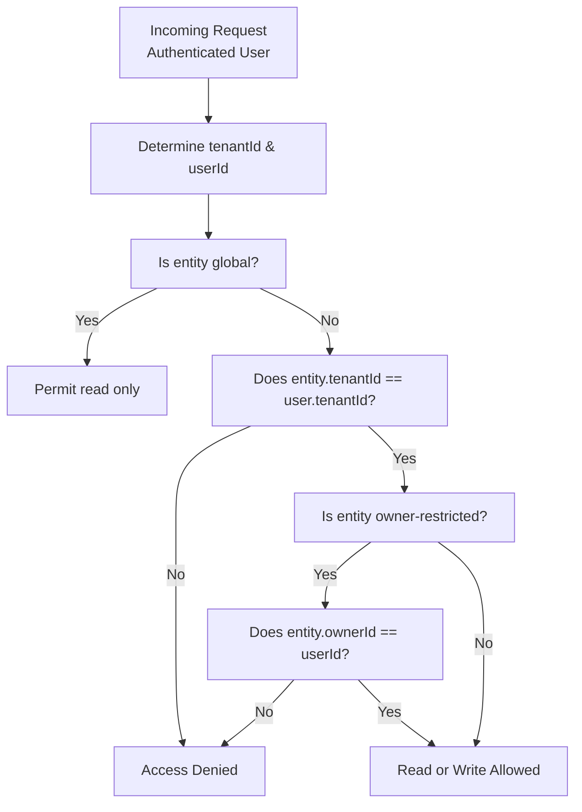

# Filename: 05-Multitenancy.md
# Universal Entity Engine (UEE)
## Multitenancy & Ownership Model  
### Audience: AI Agents • Developers • Architects • Non‑Technical Readers

---

# 🏢 1. Introduction

The Universal Entity Engine (UEE) is designed as a **multi‑tenant, multi‑user, multi‑application SaaS substrate**.

The UEE multitenancy model supports:
- Single users  
- Organizations  
- Teams  
- Nested or delegated ownership  
- Multi‑application ecosystems  
- Cross-tenant defaults  
- Zero-schema, metadata-driven tenancy  

This document explains how tenants, users, and visibility rules are implemented.

---

# 🧠 2. Principles of UEE Multitenancy

UEE opts for **metadata-based tenancy**, not schema-based partitioning.

This provides:
- Infinite extensibility  
- Per-tenant isolation  
- Per-user personalization  
- Cross-application interoperability  
- Easy onboarding  
- No database migrations  
- Plugin-driven governance  

Tenancy is enforced through **entity metadata** and **query filters**, not separate databases or collections.

---

# 🧱 3. Core Fields Governing Multitenancy

Every entity contains:

```json
{
  "tenantId": "GUID | null",
  "ownerId": "GUID | null"
}
```

These two fields govern the entire visibility model.

### **tenantId**
- `null` = global system-level entity  
- `<guid>` = entity belongs to a specific tenant  

### **ownerId**
- `null` = entity is tenant-owned  
- `<guid>` = entity is user-owned  

Tenant and user ownership can coexist.

---

# 🏷 4. Visibility Matrix

The table below defines how entities become visible:

| tenantId | ownerId | Meaning | Visible To |
|----------|---------|---------|------------|
| null | null | Global default entity | Everyone |
| T | null | Tenant-level entity | All users in tenant T |
| T | U | User-owned tenant entity | User U only (or team if extended) |
| null | U | Global user entity | User U only |
| T1 | U1 | User U1 in tenant T1 | U1 only |

This model covers:
- Team resources  
- Shared workflows  
- Personal items  
- Global defaults  
- System templates  
- App-specific presets  

---

# 🔐 5. Access Control Layers

UEE enforces multitenancy at three layers:

## **1. API Layer (Request Scope)**
Upon request:
- Determine `tenantId` from auth context  
- Determine `userId`  
- Reject if mismatched  

## **2. Query Layer (Visibility Filtering)**
Every query applies:
- `tenantId in {null, user.tenantId}`  
- `ownerId in {null, userId}`  

Plugins can add rules.

## **3. Write Model (Command Layer)**
All writes attach:
- `tenantId` from request context  
- `ownerId` if user-owned  

---

# 🗺️ 6. Tenancy Flow Diagram



---

# 🌍 7. Types of Tenancy in UEE

UEE supports multiple tenancy patterns simultaneously.

## **1. Single-User Tenants**
Perfect for:
- Personal apps  
- Individual productivity tools (e.g., DivFlo solo user)

## **2. Organization Tenants**
Users belong to a shared workspace.

## **3. Hybrid**
User and tenant entities coexist.

Example:
- A task system where:
  - Team tasks → tenant-owned  
  - Personal notes → user-owned  

## **4. Federation**
Multiple apps share a tenant.

Example:
- DivFlo (tasks)  
- CRM module  
- “Energy tracking app” 
- Scheduling assistant  

All share the same tenant space → shared telemetry → cross-application intelligence.

---

# 🧩 8. Tenant-Onboarding Process

Tenant onboarding creates:

1. **Tenant entity**
```json
{
  "entityTypeId": "uee.tenant",
  "attributes": { "name": "Acme Corp" }
}
```

2. **User entities**
```json
{
  "entityTypeId": "uee.user",
  "tenantId": "<tenant>",
  "attributes": { "email": "person@acme.com" }
}
```

3. **Default global entity cloning**
If desired, defaults like:
- EntityTypes  
- Starter workflows  
- Default plugins  
are cloned or referenced.

4. **Event stream subscriptions initialized**

---

# 🧮 9. Tenant-Scoped Projections

Projections (read models) are always tenant-scoped.

UEE uses one of:
- **Single shared collection with tenantId index**  
- **Plugin-specific collections partitioned by tenant**  
- **Sharded collections based on tenant hash** (for high scale)

Read models are rebuilt per tenant if needed.

---

# 🔐 10. Tenant Security

UEE tenancy guarantees:

## **Isolation**
Tenants cannot see each other’s data.

## **Hierarchy**
`global` → `tenant` → `user`  

## **Extensibility**
Plugins may enforce extra rules.

## **Compatibility**
Works with OAuth, JWT, SSO, custom auth.

---

# 🔄 11. Cross-Tenant Defaults

UEE supports global defaults (where `tenantId = null`) that all tenants inherit.

Examples:
- Default entity types  
- System-level workflows  
- Base ML models  
- Configuration templates  
- Default plugins  

This allows:
- Rapid onboarding  
- Multi-application consistency  
- Platform-wide upgrade paths

---

# 🤝 12. Multi-Application Tenancy (The Most Important Feature)

UEE is designed for ecosystems.

**Multiple applications share a tenant**, allowing:
- Shared telemetry  
- Cross-domain personalization  
- Unified ML behavioral models  
- Reuse of plugins  
- Universal entity definitions  
- Seamless plugin installation  

Example:

```
Tenant: "Team Phoenix"
    ├── DivFlo Task Manager
    ├── CRM Module
    ├── Time/Energy Tracker
    ├── Plugin: “ADHD Workflow Optimizer”
    └── Plugin: “ML Task Classifier”
```

Each app is still isolated logically, but:
- They share tenant-wide entities  
- They share user-owned entities  
- They share telemetry and ML insights  
- They can reuse view definitions and workflows  

This is a **superpower**.

---

# 🧬 13. Multitenant Telemetry

Telemetry follows the same rules:
- Global telemetry (system trends)  
- Tenant telemetry (team behaviors)  
- User telemetry (personal patterns)  

AI models can use:
- Per-user embeddings  
- Per-tenant cluster patterns  
- Global models fine-tuned for each tenant  

This supports:
- Adaptive UI  
- Energy-aware scheduling  
- Personalized workflow automation  
- Cross-application intelligence  

---

# 🧠 14. Multitenancy for Plugins

Plugins can be:
- Global (tenantId = null)
- Tenant-specific
- User-specific

Plugins may declare:
- Which entities they operate on  
- Which tenant(s) they serve  
- Which streams they subscribe to  
- Which read models they update  

This allows tenants to:
- Install plugins like apps  
- Run experiments  
- Toggle features  
- Personalize AI models  

---

# 🏁 15. Summary

The UEE multitenancy model provides:

- Full isolation without schema fragmentation  
- Tenant and user ownership via metadata  
- Global defaults for platform-wide features  
- Per-tenant extensibility  
- Per-user personalization  
- Multi-application ecosystem support  
- Dynamic plugin and view scoping  
- Powerful telemetry segmentation  

UEE’s metadata-based tenancy is highly flexible, infinitely extensible, and essential for building a **universal operating system for entities, applications, and adaptive intelligence**.

---
``