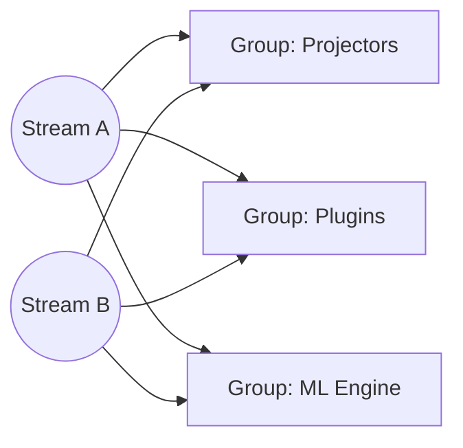
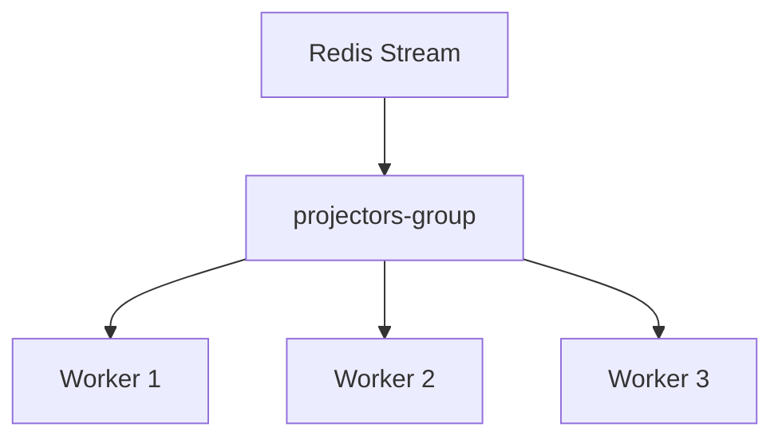
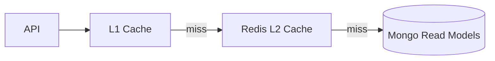
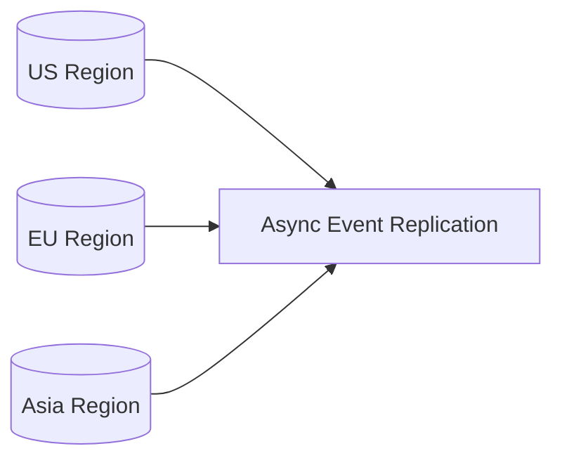

# Filename: 10-Scalability.md
# Universal Entity Engine (UEE)
## Scalability & Performance Architecture  
### Audience: AI Agents • Developers • Architects • Non‑Technical Readers

---

# 🚀 1. Introduction

The Universal Entity Engine (UEE) is designed to scale from **single‑developer startup deployments** to **planet‑scale multi‑tenant SaaS ecosystems**.

Scalability in UEE is not an afterthought — it is a core design constraint.  
By combining **Event Sourcing**, **Redis Streams**, **MongoDB**, **projection pipelines**, and **L1/L2 caching**, UEE supports:

- Extremely high write throughput  
- Horizontally scalable read performance  
- Multi‑tenant isolation at metadata level  
- Massive plugin ecosystems  
- Zero‑downtime evolution  
- ML‑powered adaptive systems  
- Global personalization across applications  

This document describes how UEE scales across all layers.

---

# 🧱 2. Layers of Scalability

UEE scales in five dimensions:

1. **API Layer (stateless horizontal scaling)**  
2. **Command Layer (write throughput)**  
3. **Event Streams (Redis Streams horizontal fan‑out)**  
4. **Projections & Plugins (consumer group parallelism)**  
5. **Read Models (indexed MongoDB clusters + L1/L2 caching)**  

Each layer can scale independently.

---

# ⚙️ 3. API Layer Scaling

The UEE API is fully **stateless**.

This means you can scale the API horizontally by adding more nodes behind a load balancer.

### Key characteristics:
- Each instance maintains its own **L1 cache**  
- All instances share the **L2 Redis cache**  
- Zero coordination between nodes  
- Perfect for FaaS or serverless deployments  

Scaling the API horizontally increases:
- Read throughput  
- Command ingestion capacity  
- Resilience to spikes  
- Multi‑region deployment options  

---

# 🔁 4. Write Model Scaling

Write scaling is governed by event throughput.

UEE uses:

- **Optimistic concurrency**  
- **MongoDB transactions** only around event append + outbox insert  
- **Append‑only** event structure with efficient indexing  
- **Small event documents** for minimal commit cost  

This yields:
- Very high write throughput (tens of thousands ops/sec)  
- Predictable performance under multi‑tenant load  
- Low write amplification  

If more throughput is needed:
- MongoDB horizontal sharding  
- Partition events by `entityId` hash  
- Partition outbox by shard  

Event storage can scale linearly with cluster nodes.

---

# 📡 5. Event Stream Scaling (Redis Streams)

Redis Streams is the **central messaging fabric** of UEE.

Scalable because:
- **Consumer groups** allow parallel consumption  
- **Multiple consumers per group** increase throughput  
- **Multiple groups** allow plugins, ML, and projections to operate independently  
- **Streams can be sharded** by entityType or tenant  
- **Backpressure** is automatically managed  

### Horizontal fan-out pattern:

When stream volume increases beyond the capacity of a single stream:
- Hash events to multiple streams  
- Each stream gets its own consumer groups  
- Plugins declare which streams they subscribe to  

This allows **unbounded horizontal scaling**.

---

# 🧮 6. Projection Layer Scaling

Projections are CPU‑heavy tasks that run in the background.

UEE projection scaling features:
- Multiple workers per consumer group  
- Automatic load balancing across workers  
- Safe replayability  
- Parallel partitioning by tenant/entityType  
- Ability to run different projections on different node pools  

### Example projector scaling diagram:

Scaling projection workers increases:
- Read model update throughput  
- Plugin execution throughput  
- ML feature extraction throughput  

---

# 🧰 7. Plugin Runtime Scaling

Plugins (WASM or native) run inside worker pools.  
These can scale independently of projection workers.

Reasons to separate:
- Heavy ML workloads  
- Workflows with long-running tasks  
- Tenant-specific isolation  
- Experimentation  

### Plugin scaling options:
- Dedicated worker pools  
- CPU-limited WASM runtimes  
- GPU-backed ML pools  
- Per-tenant plugin pools  
- Sharded plugin execution by entityType  

This keeps the system responsive even under massive plugin ecosystems.

---

# 🔍 8. Read Model Scaling

Read models are stored in **MongoDB** and served via:

1. **L1 In‑Process Cache**  
2. **L2 Redis Distributed Cache**  
3. **MongoDB Read Models**

The layered caching model gives:
- Ultra fast reads (microseconds from memory)  
- Redis-level horizontal scalability  
- Database-level consistency guarantees  

### Example read flow:

### MongoDB read model scaling:
- Use sharded collections  
- Index by `(tenantId, entityTypeId, entityId)`  
- Partition read models by plugin  
- Use compact schemas for dense models  

Read throughput can scale to **millions of reads per second** globally.

---

# 🛡️ 9. Multi-Tenant Scalability

UEE's metadata-based tenancy model improves scalability:

- No need for per-tenant schemas  
- No per-tenant databases  
- No migration overhead  
- Easy to onboard large numbers of tenants  
- Query isolation via indexes  
- Projection partitioning per tenant  

Tenants remain logically isolated even when sharing the same clusters.

---

# 🌍 10. Geographic Scaling (Multi‑Region)

Multi-region deployment becomes easy because:

- API nodes are stateless  
- Redis Streams can be region-sharded  
- MongoDB supports multi-region clusters  
- Read models can be region-local  
- Events can flow across regions with async replication  

A region topology might look like:

Each region has:
- Local API layer  
- Local L1/L2 cache  
- Region-local read models  
- Shared or federated event streams  

---

# 🧬 11. Scaling for ML & Personalization

The ML pipeline spans:
- Telemetry ingestion  
- Feature extraction  
- Model inference  
- Model updates  
- Per-user profile updates  

Each component can scale independently using:
- Stream partitioning  
- ML worker pools  
- GPU-backed inference clusters  
- Cached embeddings  
- Tenant-specific models for large customers  

This enables **adaptive intelligence at global scale**.

---

# 🔥 12. Startup → Scale Evolution Path

UEE is explicitly designed to grow with product maturity.

## **Stage 1: Startup (Local Dev / Single Node)**
- Single MongoDB instance  
- Single Redis instance  
- One API server  
- One projector / plugin worker  
- No sharding or multi-region complexity  

### Performance:
- Supports a small team or early SaaS product immediately.

---

## **Stage 2: Growth (Small SaaS)**
- 3–5 API nodes  
- Redis cluster  
- MongoDB Replica Set  
- Dedicated plugin workers  
- Basic ML  
- Multiple projections  

### Performance:
- Supports thousands of tenants and millions of entities.

---

## **Stage 3: Enterprise Scale**
- Horizontally scaling API layer  
- MongoDB Sharded Cluster  
- Redis Stream sharding  
- Tenant-aware projection pools  
- ML worker auto-scaling  
- Region-local read models  
- S3/GCS cold storage for event archiving (optional)

### Performance:
- Multi-region, millions of users, billions of entities.

---

## **Stage 4: Planet Scale**
- Region federation  
- Per-continent read models  
- Distributed ML personalization  
- Elastic plugin execution (FaaS-like)  
- Event stream graph partitioning  
- Global telemetry pipelines  

This stage enables:
- Multi-application ecosystems  
- Cross-application personalization  
- Global user behavioral models  

UEE effectively operates like **a cloud OS for adaptive software**.

---

# 💡 13. Performance Optimization Techniques

### **Write Side**
- Event payload compaction  
- Append-only storage  
- Micro-batching outbox workers  
- Optimistic concurrency  
- Sharded event collections  

### **Event Streams**
- Stream sharding  
- Consumer group parallelism  
- Backpressure avoidance  
- Slow consumer isolation  

### **Read Side**
- L1/L2 hierarchical caching  
- Pre-materialized read models  
- Plugin-specific projections  
- TTL-based cache invalidation  

### **ML Pipeline**
- Embedding caches  
- GPU-accelerated inference  
- Distributed feature stores  
- Asynchronous model updates  

---

# 🏁 14. Summary

The UEE scales because it is built on:

- **Event sourcing (immutable history)**  
- **Redis Streams (horizontal fan-out)**  
- **MongoDB (document sharding)**  
- **Stateless API nodes**  
- **Independent worker pools**  
- **Tenant-aware metadata**  
- **Plugin-driven extensibility**  
- **AI-native telemetry pipelines**  

This architecture makes UEE capable of powering:

- Small personal apps  
- Large enterprise platforms  
- Multi-application ecosystems  
- Adaptive AI-driven experiences  
- Global-scale neural behavior models  

UEE is built not just for scale —  
it is built for **evolution at scale**.

---