# Universal Entity Engine (UEE)

## A High‑Level Overview  

### Audience: AI Agents • Software Developers • Non‑Technical Readers

---

## 🌐 What Is the Universal Entity Engine?

The **Universal Entity Engine (UEE)** is a **multi‑tenant, event‑sourced, plugin‑extensible** runtime designed to act as an **Operating System for Entities**.

UEE is not a single application — it is a **platform** upon which many applications can be built, each with its own UI, workflows, and domain logic. Everything — data, configuration, workflows, machine‑learning models, plugins, and even read‑models — is represented as an **Entity** within a unified storage and event system.

UEE supports:

- Single‑user tenants  
- Team tenants  
- SaaS products  
- Embedded clients  
- AI‑generated workflows  
- WASM plugins  
- Cross‑application telemetry  
- Dynamic materialized views  
- Evolutionary user‑adaptive behaviors  

It is designed to scale from **startup** to **planet‑scale**, while keeping the system simple enough for a single developer and powerful enough for a fully AI‑driven development ecosystem.

---

## 🧠 Core Philosophy

The UEE embraces six fundamental ideas:

### **1. Everything is an Entity**

Every piece of data — tasks, notes, CRM objects, user behavior logs, ML feature profiles, UI schema definitions — is stored as an entity.

### **2. Entities Are Immutable & Versioned**

Each update generates a new version, retaining full historical context, enabling:

- Telemetry  
- Time‑travel debugging  
- Machine‑learning timelines  
- Adaptive personalization  

### **3. Event Sourcing at the Heart**

All changes are events.  
All events form a universal activity stream.

This enables:

- Ultra‑fast writes  
- Accurate historical replay  
- Deterministic read‑model regeneration  
- Real‑time plugin processing  

### **4. Plugins Define System Intelligence**

Plugins (often WASM modules) can:

- Process events  
- Materialize read models  
- Perform ML inference  
- Implement workflows  
- Extend or enhance client UX  

UEE is designed so plugins can be created by:

- Developers  
- AI agents  
- Community contributors  
- Organizations extending the platform  

### **5. Multi‑Tenant but Globally Extensible**

A single cluster can support:

- Many apps  
- Many tenants  
- Many user groups  

Global "default" entities serve as templates or system‑level definitions.  
Tenant and user entities overlay that foundation.

### **6. Telemetry as First‑Class Citizen**

Everything is observed.

UEE records:

- Behavioral signals  
- Application flows  
- Interaction events  
- Energy‑pattern correlations  
- ML‑ready datasets  

Apps built on UEE can share what they learn (with user consent).  
This creates a universal cross‑application personalization layer.

---

## 🏗 High‑Level Architecture (Conceptual)

```mermaid
flowchart LR
    UI[Client Apps<br/>UIs in Any Language] --> API[UEE API Layer]

    subgraph Engine["Universal Entity Engine"]
        API --> Commands[Command Handlers]
        Commands --> Events[(Event Store)]
        Events --> Redis[Event Stream Pipeline]
        Redis --> Proj[Materializers<br/>&#40;Plugins / WASM&#41;]
        Proj --> ReadModels[(Read Model DB)]
        Proj --> Telemetry[(Telemetry + ML Signals)]
        API --> Reads[Read API]
        Reads --> CacheL1[L1 In‑Memory Cache]
        CacheL1 --> CacheL2[Redis L2 Cache]
        CacheL2 --> ReadModels
    end
```

---

## 🔌 Extensibility Model

UEE is designed to be entirely modular:

| Component | Extensible By | Description |
|----------|----------------|-------------|
| **Entity Types** | Apps & Plugins | Define new domain models without new backend code |
| **Handlers** | WASM plugins | Custom processing of events, workflows, ML |
| **Read Models** | WASM plugins or AI agents | Any projection pipeline can create new views |
| **Client Apps** | Independent developers | Front‑end or backend built on top of UEE’s API |
| **Telemetry Processors** | ML models, AI agents | Adaptive personalization, insights |

---

## 🔐 Multi‑Tenant + Multi‑User Model

UEE entities include metadata:

- `tenantId?` — Or null for “global default” entities  
- `ownerId?` — Personal or team ownership  
- `entityId` — Stable GUID  
- `version` — Incrementing integer  

Visibility Rules:

- Default entities: `tenantId = null` and `ownerId = null`  
- Tenant entities: visible to all users within tenant  
- User‑owned entities: visible only to the user  
- Applications define client‑side logic on top of these rules  

---

## 🔬 Why Telemetry Matters

UEE is built for adaptive systems, especially:

- Task managers  
- Productivity tools  
- CRMs  
- Workflow engines  
- AI‑assisted applications  

Because everything is event‑sourced, UEE can answer:

- *What workflows actually help a user?*  
- *How does the user's energy vary throughout the day?*  
- *Which UI layout increases completion rate?*  
- *Which AI models reduce overwhelm or churn?*  

By creating a **universal behavior graph**, UEE allows cross‑application personalization.

---

## 🤝 Example Application: DivFlo (Divergent Flow)

DivFlo is a task system built on UEE:

- Multi‑tenant  
- Multi‑user  
- Adaptive workflows  
- Energy‑pattern‑aware task suggestions  
- Shame‑free task management  

DivFlo contributes telemetry and receives personalized insights from the shared UEE substrate — and any other apps a user installs.

---

## 🧩 Who This Document Is For

### 🟦 **AI Agents**

UEE is designed for AI‑native operations:

- AI can generate plugins  
- AI can optimize read models  
- AI can analyze telemetry  
- AI can collaborate with human developers  
- AI can create entire client applications on top of UEE

### 🟩 **Developers**

UEE allows:

- Rapid extension  
- Schema‑less modeling  
- Safe event‑sourced updates  
- Custom front‑ends  
- Serverless plugins  
- Full CQRS + event sourcing power

### 🟨 **Non‑Technical Users**

UEE allows:

- Apps that adapt to their preferences  
- Customizable workflows  
- Personalized automation  
- Multi‑app synergy  
- Consistent data ownership and portability  

---

## ✨ Summary

The **Universal Entity Engine** is:

- An **event‑sourced core**
- A **multi‑tenant entity system**
- A **plugin‑defined workflow engine**
- A **telemetry‑first AI substrate**
- A **cross‑application personalization layer**
- A **universal data and behavior graph**
- A **foundation for building adaptive, neurodiverse‑friendly software**

UEE aims to become the **operating system for modular, observable, AI‑enhanced applications** — enabling every user and app to evolve continuously.

---
