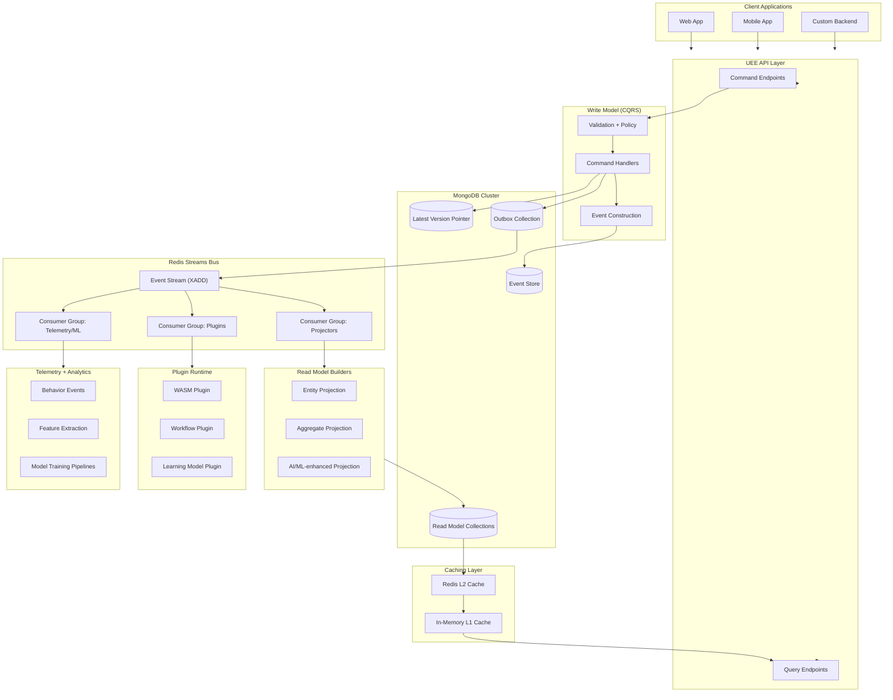
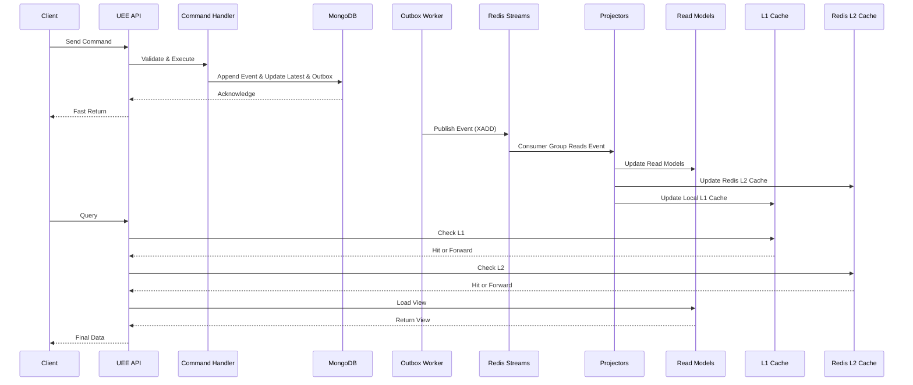

# Filename: 01-Architecture.md

# Universal Entity Engine (UEE)

## System Architecture Overview  

### Audience: AI Agents • Developers • Technical Architects • Non‑Technical Readers

---

# 🏛️ 1. Introduction

This document describes the **overall architecture** of the **Universal Entity Engine (UEE)** — a distributed, extensible, event‑sourced entity runtime capable of powering multi‑tenant SaaS applications, adaptive ML‑driven systems, plugin ecosystems, behavioral telemetry engines, and domain‑agnostic data workflows.

The UEE is composed of several subsystems:

- **API Layer**  
- **Command Processing Layer (CQRS Write Model)**  
- **Event Store (MongoDB)**  
- **Event Publication Layer (Outbox + Redis Streams)**  
- **Projection / Read Model Layer**  
- **Caching Layer (L1 in‑process + L2 Redis)**  
- **Plugin Runtime (WASM + native)**  
- **Telemetry/ML Pipeline**  
- **Multi‑Tenant Governance Layer**

This document gives a high-level breakdown of these components and how they interact.

---

# 🧩 2. Top‑Level Architecture Diagram



---

# 🧠 3. Architectural Principles

### **1. Event‑Sourced Core**

Every change to any entity is captured as an immutable event:

- No in-place mutations  
- Full version history  
- Perfect replayability  
- Deterministic projections  

### **2. CQRS Separation**

Commands = state mutation  
Queries = read‑only and optimized  

This separation keeps the system clean, scalable, and predictable.

### **3. Streaming Backbone (Redis Streams)**

Redis Streams act as the **central nervous system** for:

- Projection updates  
- Plugin execution  
- Telemetry propagation  
- ML feature pipelines  

### **4. Entity Schema Freedom**

The UEE imposes only the **minimal base metadata**:

- `entityId`  
- `version`  
- `entityTypeId`  
- `tenantId?`  
- `ownerId?`  
- `createdAt`  
- `attributes` (flexible JSON/BSON)

Everything else is up to plugins or clients.

### **5. Multi‑Tenant Isolation by Metadata**

No schema separation per tenant. Metadata gating controls visibility.

### **6. Infinite Extensibility via Plugins**

Custom logic doesn’t require platform changes.  
Plugins are:

- Versioned  
- Hot‑swappable  
- Event‑driven  
- Sandboxed (WASM)  

### **7. Observability and Telemetry as First-Class**

UEE is designed for systems that evolve:

- Behavior tracking  
- Model updates  
- Adaptive workflows  
- AI‑driven personalization  

---

# 🧱 4. Core Subsystems

Below is a breakdown of each subsystem and its responsibility.

---

## 4.1 API Layer

### Purpose

Expose the engine to external clients:

- REST or GraphQL  
- Command endpoints  
- Query endpoints  

### Responsibilities

- Authenticate & authorize tenant/user  
- Route commands to Command Handlers  
- Route queries through L1/L2 and Read DB  
- Enforce rate limits, quotas  
- Provide plugin discovery endpoints  

---

## 4.2 Write Model (Commands)

### Purpose

Handle all mutations.

### Flow

1. Validation  
2. Permission check  
3. Construct domain event(s)  
4. Append to `events` collection  
5. Update `latest` pointer  
6. Insert into `outbox`  
7. Return acknowledgment immediately

### Why this design?

- Low-latency writes  
- Zero coupling to read model  
- Eventual consistency by design  
- ML and plugins trigger automatically after commit  

---

## 4.3 Event Store (MongoDB)

The Event Store is an **append‑only log** of entity changes.

### Collections

- `events`: immutable entity event documents  
- `latest`: pointer document `{ entityId, latestVersion }`  
- `outbox`: events waiting for Redis publication  

### Indexes

- Index on `(entityId, version)`  
- Index on `tenantId`  
- TTL index optional for telemetry events (if desired)

---

## 4.4 Outbox Pattern

UEE uses the **Transactional Outbox Pattern**:

- Ensures that events are published **exactly once**  
- Decouples database writes from stream publication  
- Guarantees state changes and stream events stay in sync  

A background worker moves messages from Mongo → Redis Streams.

---

## 4.5 Redis Streams

Redis Streams solve:

- Fan‑out  
- Replay  
- Consumer groups  
- Backpressure  
- Parallelized plugin processing  
- Event-driven architecture  

### Why not FIFO queues?

FIFO lists do *not* support:

- Consumer Groups  
- Ordering guarantees under concurrency  
- Acknowledgment + redelivery  
- Replay for new plugin consumers  
- Horizontal scaling  

Streams are the correct backbone for large-scale event processing.

---

## 4.6 Projection Engine (Read Models)

Projections are constructed by subscribing to event streams and updating:

- Entity views  
- Aggregates  
- Materialized views  
- AI-feature enriched views  
- App-specific read stores  

Plugins can define their own projections.

### Design

- Idempotent  
- Version-aware  
- Eventually consistent  
- Rebuildable  

---

## 4.7 Caching Layer (L1/L2)

### L1 — Process-local

`ConcurrentDictionary<Guid, CachedView>`  

- Ultra-fast  
- Updated by projectors  
- Evicted on version mismatch  

### L2 — Redis Cache  

- Tenant-wide  
- Shared across clients  
- TTL optional  

Reads flow:

```
L1 → L2 → ReadModel DB → rebuild
```

---

## 4.8 Plugin Runtime (WASM)

Plugins support:

- Event processing  
- ML inference  
- Workflow logic  
- Automated experiments  
- Custom read model pipelines  

Plugins are:

- Versioned entities  
- Deployed dynamically  
- Sandboxed  
- Event-driven  

This enables "apps built from entities."

---

## 4.9 Telemetry Layer

All system activity produces events:

- User behavior  
- Workflow timings  
- Productivity rhythms  
- Energy patterns  
- Plugin performance  
- Error logs  
- Interaction history  

Telemetry feeds into feature extraction and model training pipelines.

---

# 🧬 5. Data Flow Summary



---

# 🏁 6. Summary

The Universal Entity Engine architecture:

- Uses **event sourcing** for correctness and ML‑friendly history  
- Uses **Redis Streams** as the high-scale event fabric  
- Separates reads and writes using **CQRS**  
- Enables **infinite extensibility** through WASM plugins  
- Supports **multi‑tenant SaaS** cleanly via metadata, not schema  
- Provides **dynamic read models**  
- Emphasizes **observability & telemetry**  
- Supports **adaptive, AI‑driven experiences** across applications  

This architecture makes UEE a **foundation for AI‑native, user‑adaptive, entity‑centric applications**.

---
