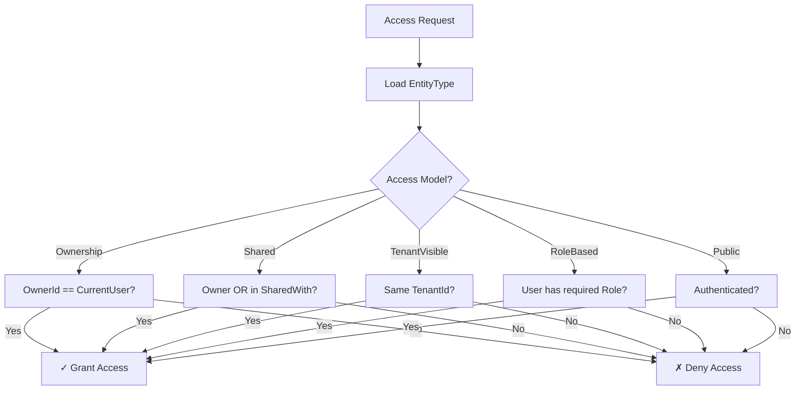

# Universal Entity Engine (UEE)

## Entity Model Specification  

### Audience: AI Agents • Developers • Technical Architects • Non‑Technical Readers

---

# 📦 1. Introduction

The **Entity Model** is the foundational abstraction of the Universal Entity Engine (UEE).  
Every piece of information — from user-created objects to plugins, workflows, ML models, system defaults, view definitions, and telemetry — is expressed as an **Entity**.

Entities are:

- **Immutable** (each update results in a new version)
- **Versioned**
- **Multi‑tenant aware**
- **Schema‑flexible** (attributes stored as JSON/BSON)
- **Event‑sourced**
- **Accessible through a unified API**

The Entity Model allows UEE to behave like an **operating system for structured knowledge**.

---

# 🧱 2. Core Entity Schema

UEE uses a unified envelope structure for all entities.

```json
{
  "entityId": "GUID",
  "version": 17,
  "entityTypeId": "GUID",
  "tenantId": "GUID | null",
  "ownerId": "GUID | null",
  "createdAt": "ISO timestamp",
  "createdBy": "GUID",
  "attributes": { "key": "value", "...": "..." },
  "metadata": {
    "tags": ["optional"],
    "source": "optional plugin or system reference",
    "description": "optional",
    "ttl": "optional time-to-live",
    "custom": {}
  }
}
```

### Field meanings

- **entityId**: Stable root identity  
- **version**: Incrementing integer per entity revision  
- **entityTypeId**: Defines structure & purpose (also an entity)  
- **tenantId**: Null for global defaults; otherwise tenant-local  
- **ownerId**: Optional user‑specific ownership  
- **attributes**: Arbitrary structured data  
- **metadata**: System-defined or plugin-defined details  

---

# 🏷 3. Entity Identity Model

An entity’s identity is composed of:

- **entityId** → “what this thing is”  
- **version** → “which state of it”  

Versions are **append-only**.  
You can never overwrite a previous version.

This enables:

- Full time-travel history  
- Telemetry across versions  
- Reconstruction of deleted or broken states  
- ML sequence modeling (learning from evolution)  
- Rollback and debugging  

---

# 🧬 4. Entity Lifecycle

### The lifecycle looks like this

```mermaid
flowchart LR
    C[Create v1] --> U1[Update v2]
    U1 --> U2[Update v3]
    U2 --> U3[Update v4]
    U3 --> U4[Update v5]
    U4 --> D[Soft Delete &#40;v6&#41;]
    D --> R[Restore or Fork]
    R --> U5[Continue at v7...]
```



### Lifecycle principles

1. Nothing is destroyed  
2. Everything is versioned  
3. All versions remain queryable  
4. Deletes are soft (create a delete‑flag version)  
5. Restores create new versions  
6. Forks are allowed via custom workflows or plugins  

---

# 🧩 5. Entity Types

**Entity Types are themselves entities.**

This means:

- Apps can define custom types at runtime  
- Plugins can introduce new types  
- UI clients can define specialized types for workflows  
- AI agents can generate types dynamically  

### Example EntityType definition

```json
{
  "entityId": "339ee6ef-a181-4bcc-aa14-64aca8977f3c",
  "version": 1,
  "entityTypeId": "uee:entityType",
  "attributes": {
    "name": "DivFlo.Task",
    "schema": {
      "title": "string",
      "description": "string",
      "dueDate": "datetime",
      "priority": "int",
      "energyRequired": "float"
    }
  }
}
```

Because EntityTypes are versioned, **the schema can evolve** without migrations.

---

# 🏛 6. Multi‑Tenant & Multi‑Owner Semantics

UEE uses metadata fields to govern visibility:

| tenantId | ownerId | Meaning                         |
| -------- | ------- | ------------------------------- |
| null     | null    | Global default entity           |
| T        | null    | Tenant-wide entity              |
| T        | U       | User-owned entity within tenant |
| null     | U       | User-owned global entity (rare) |

### Rules

- Tenants **inherit** global entities  
- Users **inherit** tenant entities  
- Ownership is optional  
- Application logic can layer additional rules  

Example: DivFlo may allow team tasks or personal tasks using the same entity model.

---

# � 6.1 Access Control (EntityType-Driven)

Access control in UEE is **flexible** and **defined per EntityType**, not hardcoded into the core.

### Design Principles

1. **EntityType defines the rules** — Each type declares its access model
2. **Entity Metadata carries instance data** — Sharing lists, access levels, etc.
3. **Runtime evaluates dynamically** — Plugins can implement custom evaluators
4. **No one-size-fits-all** — Different entities need different security models

### Access Control Models

| Model | Description | Use Case |
|-------|-------------|----------|
| `Ownership` | Only owner can access | Personal tasks, private notes |
| `Shared` | Owner + explicit share list | Collaborative documents |
| `TenantVisible` | Anyone in tenant can view | Team announcements, shared resources |
| `RoleBased` | Access by role membership | Admin-only settings, manager dashboards |
| `Public` | All authenticated users | Global templates, public content |

### EntityType Access Control Schema

Access rules are defined in the EntityType's `attributes.accessControl`:

```json
{
  "entityId": "339ee6ef-a181-4bcc-aa14-64aca8977f3c",
  "entityTypeId": "uee:entityType",
  "attributes": {
    "name": "DivFlo.Task",
    "schema": {
      "title": "string",
      "description": "string",
      "dueDate": "datetime"
    },
    "accessControl": {
      "model": "Shared",
      "allowSharing": true,
      "defaultAccess": "Private",
      "shareRoles": ["Viewer", "Editor", "Admin"],
      "inheritFromParent": false
    }
  }
}
```

### Access Control Fields

| Field | Type | Description |
|-------|------|-------------|
| `model` | string | The access model: `Ownership`, `Shared`, `TenantVisible`, `RoleBased`, `Public` |
| `allowSharing` | boolean | Whether instances can be shared with other users |
| `defaultAccess` | string | Default visibility: `Private`, `TenantVisible`, `Public` |
| `shareRoles` | string[] | Available roles when sharing (e.g., Viewer, Editor) |
| `inheritFromParent` | boolean | Whether to inherit access from parent entity |

### Entity Instance Metadata

When sharing is enabled, entity instances carry access data in `metadata`:

```json
{
  "entityId": "task-1234",
  "entityTypeId": "DivFlo.Task",
  "ownerId": "user-alice",
  "metadata": {
    "sharedWith": [
      { "userId": "user-bob", "role": "Editor", "grantedAt": "2026-02-01T10:00:00Z" },
      { "userId": "user-carol", "role": "Viewer", "grantedAt": "2026-02-01T11:00:00Z" }
    ],
    "accessLevel": "Private"
  }
}
```

### Access Evaluation Flow



### Example Scenarios

**Scenario 1: Single-User Tenant (Personal Task)**
```
EntityType: DivFlo.Task (model: Ownership)
TenantId: tenant-alice
OwnerId: user-alice
CurrentUser: user-alice
→ Access GRANTED (owner matches)
```

**Scenario 2: Team Tenant (Shared Document)**
```
EntityType: DivFlo.Document (model: Shared)
TenantId: tenant-team
OwnerId: user-alice
SharedWith: [{ userId: user-bob, role: Editor }]
CurrentUser: user-bob
→ Access GRANTED (in share list with Editor role)
```

**Scenario 3: Team Announcement**
```
EntityType: DivFlo.Announcement (model: TenantVisible)
TenantId: tenant-team
OwnerId: null (team-owned)
CurrentUser: user-carol (member of tenant-team)
→ Access GRANTED (same tenant)
```

**Scenario 4: Admin Settings**
```
EntityType: DivFlo.TenantSettings (model: RoleBased, requiredRole: Admin)
TenantId: tenant-team
CurrentUser: user-bob (has Editor role, not Admin)
→ Access DENIED (missing required role)
```

### Plugin-Based Custom Evaluators

For complex scenarios, plugins can implement custom access logic:

```csharp
public interface IAccessControlEvaluator
{
    string ModelName { get; }  // e.g., "CustomHierarchical"
    
    Task<AccessResult> EvaluateAsync(
        IEntity entity,
        EntityType entityType,
        AccessContext context);
}

public record AccessResult(
    bool Granted,
    string? DenialReason = null,
    AccessLevel EffectiveLevel = AccessLevel.None);

public enum AccessLevel
{
    None,
    Read,
    Write,
    Admin
}
```

This allows:
- Hierarchical permissions (inherit from folder/project)
- Time-based access (temporary shares)
- Conditional access (only during business hours)
- External authorization (OAuth scopes, RBAC systems)

---

# �🔧 7. Attributes vs Metadata

### **Attributes**

- Primary data payload  
- JSON/BSON  
- Up to client or plugin  
- Stored versioned  
- Used by read models & workflows  

### **Metadata**

- Execution, governance, or system semantics  
- Not considered part of business attributes  
- Used for filtering, TTL, visibility, indexing  

---

# 🔍 8. Entity Version Pointers

MongoDB stores two related pieces:

### 1. **events** collection  

Stores append‑only versions.

### 2. **latest** collection  

Stores:

```json
{
  "entityId": "GUID",
  "latestVersion": 17
}
```

This allows the system to:

- Quickly resolve “current state”  
- Recover and rebuild read models  
- Handle concurrent updates gracefully  

---

# ⚙️ 9. Example Entity Instances

### Example: A DivFlo “Task” entity (version 1)

```json
{
  "entityId": "1100-2000-3000",
  "version": 1,
  "entityTypeId": "DivFlo.Task",
  "tenantId": "tenant-42",
  "ownerId": "user-11",
  "createdAt": "2026-02-01T10:03:22Z",
  "createdBy": "user-11",
  "attributes": {
    "title": "Buy groceries",
    "dueDate": null,
    "priority": 2,
    "energyRequired": 0.4
  }
}
```

### Example: Later update (version 4)

```json
{
  "entityId": "1100-2000-3000",
  "version": 4,
  "entityTypeId": "DivFlo.Task",
  "tenantId": "tenant-42",
  "ownerId": "user-11",
  "createdAt": "2026-02-01T10:05:18Z",
  "createdBy": "user-11",
  "attributes": {
    "title": "Buy groceries",
    "dueDate": "2026-02-03",
    "priority": 1,
    "energyRequired": 0.6
  }
}
```

Each version captures a point in time — perfect for telemetry or AI training.

---

# 🔌 10. Entity Relationships

Relationships are expressed through attributes:

- **Direct references**  
  `"parentEntityId": "GUID"`

- **Collections**  
  `"items": ["entityId1", "entityId2"]`

- **Tags / metadata links**  
  `"metadata": { "tags": ["project:work"] }"`

Because relationships are expressed in attributes, UEE avoids rigid foreign-key constraints and supports flexible inter‑entity graphs.

---

# 🎛 11. Entity Validation

Validation in UEE happens through:

1. **Command input validation**  
2. **EntityType schema validation (optional)**  
3. **Custom plugin validators**  
4. **AI validators** (LLM‑driven)  

Validation should never prevent writing events unless critical:

- Because events are cheap  
- Mistakes become versioned history  
- Plugins can rewrite, repair, or clean up later  

---

# 🔮 12. Entities as Behavioral Telemetry

A critical idea in UEE is:

> Every version of an entity is a behavioral signal.

This allows cross-application ML:

- Sequence modeling  
- Energy prediction  
- Churn detection  
- Workflow optimization  
- Personalized suggestions  

The Entity Model is designed to produce **clean, structured time‑series data** without extra instrumentation.

---

# 🧠 13. Entities as Extensions

Because **every system component is an entity**, UEE supports:

- ML models as entities  
- Plugins as entities  
- Workflow definitions as entities  
- UI layout definitions as entities  
- Access rules as entities  
- Preprocessing pipelines as entities  
- Prompt templates as entities  
- View definitions as entities  

This allows AI agents to:

- Generate new functionality  
- Patch workflows  
- Update system intelligence  
- Improve UX repeatedly  
- Extend the OS without downtime  

---

# 🏁 14. Summary

The UEE Entity Model provides:

- A universal envelope for all knowledge  
- Infinite extensibility  
- Historical tracking of all versions  
- Clean multi‑tenant semantics  
- Plugin and AI interpretability  
- Natural fit for ML/AI systems  
- Interoperability across apps  
- Schema‑flexibility without migrations  

Entities are the **core atoms** of the Universal Entity Engine.  
Everything else — projections, workflows, plugins, ML, analytics, UI — is built *on top of them*.

---
