# Filename: 03-EventSourcing.md
# Universal Entity Engine (UEE)
## Event Sourcing Model  
### Audience: AI Agents • Developers • Architects • Non‑Technical Readers

---

# 📜 1. Introduction

Event Sourcing is the **core persistence and behavioral recording mechanism** of the Universal Entity Engine (UEE). Instead of overwriting data, the UEE stores every change as an **immutable event** that represents a fact that occurred at a point in time.

This approach provides:
- Full historical reconstructions  
- Time‑series telemetry  
- Perfect auditability  
- ML‑friendly sequential data  
- Deterministic read‑model rebuilding  
- High‑write throughput  
- App‑independent observability  

Event Sourcing is not just a storage strategy — in UEE, it is the **foundational truth system** that powers workflows, plugins, projections, personalization, and adaptive intelligence.

---

# 🧠 2. What Is an Event?

An **Event** is an immutable record that describes **what happened**, not what the current state is.

Example event:
```json
{
  "eventId": "GUID",
  "entityId": "GUID",
  "version": 3,
  "tenantId": "tenant-42",
  "ownerId": "user-11",
  "type": "TaskUpdated",
  "timestamp": "2026-02-02T14:03:11Z",
  "data": {
    "title": "Finalize client report",
    "priority": 1
  },
  "metadata": {
    "plugin": "DivFlo.Task",
    "source": "API",
    "traceId": "..."
  }
}
```

Events form the **lifelog** of entities.

---

# 🧱 3. The Event Store

UEE uses a **MongoDB-backed append‑only store**.

Collections:

| Collection | Purpose                                      |
| ---------- | -------------------------------------------- |
| `events`   | Immutable list of all entity events          |
| `latest`   | Tracks the highest version per `entityId`    |
| `outbox`   | Pending events waiting for Redis publication |

### Events Table
Each event is written once and never changed.

Indexes:
- `(entityId, version)`
- `tenantId`
- Optional TTL on system events (if desired for telemetry)

### Why MongoDB?
- Excellent at write-heavy workloads  
- Efficient document storage for JSON/BSON  
- Flexible schema  
- Powerful indexing  
- Built-in transactions (required for Outbox Pattern)  

---

# 🔁 4. Event-Sourced Lifecycle

```mermaid
flowchart LR
    A[Command Received] --> B[Validate]
    B --> C[Generate Event&#40;s&#41;]
    C --> D[Append to Mongo events]
    D --> E[Update latest pointer]
    E --> F[Insert into Outbox]
    F --> G[Return Acknowledgment]

    G --> H[Outbox Dispatcher]
    H --> I[Redis Streams &#40;XADD&#41;]
    I --> J[Projection Consumers]
    J --> K[Read Models Updated]
```



---

# ⚙️ 5. Write Operation Semantics

A write operation in UEE always:

1. **Validates** authorization & schema  
2. **Reads latest version** (for concurrency control)  
3. **Computes new version number** = `latestVersion + 1`  
4. **Appends event** to the event store  
5. **Updates the latest version pointer**  
6. **Inserts an Outbox entry**  
7. **Commits Mongo transaction**  
8. **Returns success immediately** (no waiting for projections)

### Why immediately return?
- Low latency for clients  
- Eventual consistency  
- Parallel processing for projections & plugins  
- High write throughput  

---

# 🔐 6. Concurrency Model

UEE uses **optimistic concurrency control**.

A command includes the expected version:
```json
{ "expectedVersion": 3 }
```

Workflow:
- If `expectedVersion == latestVersion` → accept  
- Otherwise → reject with concurrency conflict  

This prevents lost updates in multi-user or multi-plugin environments.

---

# 🧬 7. Event Types

Events typically include:

- `EntityCreated`
- `EntityUpdated`
- `EntityDeleted` (soft delete)
- `EntityRestored`
- `RelationshipAdded`
- `RelationshipRemoved`
- `AttributeChanged`
- Client-defined domain events  
  (e.g., `"TaskCompleted"`, `"WorkflowTransitioned"`)

Plugins can introduce new event types — UEE does not restrict event taxonomy.

---

# 🛰️ 8. Event Envelope

All events follow the same envelope pattern:

```json
{
  "eventId": "GUID",
  "entityId": "GUID",
  "tenantId": "GUID|null",
  "ownerId": "GUID|null",
  "version": 1,
  "type": "EventTypeName",
  "timestamp": "UTC timestamp",
  "data": { "domain": "specific", "fields": "..." },
  "metadata": {
    "plugin": "optional",
    "source": "api/plugin/system",
    "traceId": "for observability",
    "tags": []
  }
}
```

The **data** field contains domain-specific information.  
**Metadata** powers telemetry, debugging, and ML enrichment.

---

# 📤 9. Outbox Pattern

The Outbox Pattern ensures that:
- Event persistence (Mongo)
- Event publication (Redis)

remain **atomic** and **synchronized**.

### Outbox Document
```json
{
  "_id": "GUID",
  "eventId": "GUID",
  "stream": "entity-events",
  "payload": { ...full event... },
  "attempts": 0,
  "readyAt": "UTC timestamp"
}
```

### Outbox Dispatcher Responsibilities
- Poll outbox for ready items  
- Publish to Redis Stream (XADD)  
- Mark as delivered  
- Retry if consumer errors occur  

This makes UEE’s event propagation reliable even under heavy load or partial outages.

---

# 📡 10. Redis Streams Pipeline

Redis Streams provide:
- **Consumer groups**  
- **Replayability**  
- **Ordered messages**  
- **Backpressure protections**  
- **Scalable parallel processing**  

Consumer groups:
- **projectors-group** — builds read models  
- **plugins-group** — invokes WASM or native logic  
- **telemetry-group** — feeds ML pipelines  

### Streams are the correct choice  
NOT FIFO queues like LPUSH/BRPOP.

FIFO queues:
- Do not support multiple consumer groups  
- Do not support reliable replay  
- Are destructive (BRPOP removes item)  
- Cannot scale horizontally for event-sourced workflows  

Redis Streams = **distributed event log**  
FIFO list = **single-consumer sequential queue**

---

# 🏗️ 11. Projections (Read Models)

Projections translate events → views.

Event sourcing stores **state transitions**, not final state.  
Projections build the “current state” for UI and API queries.

Projection pipeline:
```
Event → Plugin → Materializer → Read Model
```

Each projection is:
- Idempotent  
- Monotonic (only accepts increasing versions)  
- Rebuildable  
- Plugin-defined  
- Tenant-aware  

Read models may contain:
- Task views  
- CRM views  
- Aggregations  
- ML enhanced fields  
- Behavior-derived fields  

---

# 🔍 12. Rebuilding Read Models

Because the Event Store is complete, rebuilding is deterministic:
1. Drop read model collection  
2. Replay all events  
3. Apply projections in order  
4. Regenerate caches  

This allows:
- Schema migrations  
- ML reprocessing  
- Plugin updates  
- Bug fixes  

All with zero data loss.

---

# 🔬 13. Telemetry Through Event Streams

Every event, even low-level, is telemetry.

This enables:
- Behavioral analytics  
- Sequence modeling  
- Pattern prediction  
- Reinforcement learning  
- Multi-application personalization  
- UI optimization  

Event metadata can include:
- Latency  
- UI context  
- User action metadata  
- Plugin traces  

UEE treats events as **observations**, not just data changes.

---

# 🧠 14. Why Event Sourcing Is Perfect for UEE

Because UEE aims to:
- Support **infinite application types**
- Provide **system-wide observability**
- Allow **AI & plugins to modify system behavior**
- Track **long-term user patterns**
- Enable **cross-application personalization**
- Evolve according to individual needs

Event sourcing provides:
- Full behavioral history  
- Low-latency writes  
- Zero schema constraints  
- Complete auditability  
- Replayability  
- A publish/subscribe backbone  
- ML-ready sequential data  

UEE is, at its core, a **behavioral time machine**.

---

# 🏁 15. Summary

The UEE Event Sourcing model provides:

- Immutable, versioned record of all entity changes  
- Strong concurrency guarantees  
- High write performance  
- Reliable event propagation via Outbox + Redis Streams  
- Fully replayable historical timeline  
- Extensibility for plugins, ML, and domain logic  
- Dynamic read-model building  
- Deep telemetry for personalization and AI agents  

Event Sourcing is the backbone that makes UEE **adaptive**, **auditable**, **pluggable**, and **infinitely extensible**.

---