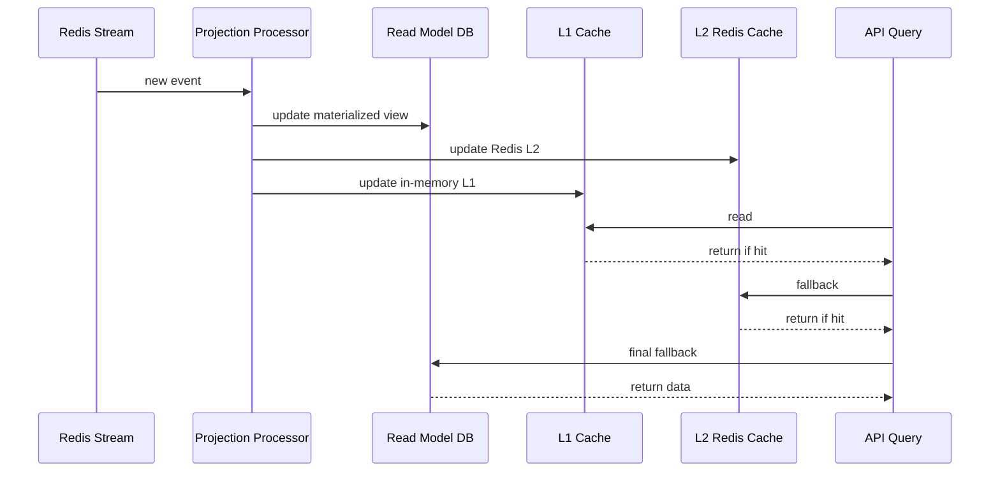

# Filename: 04-ReadModels.md
# Universal Entity Engine (UEE)
## Read Models & Projections  
### Audience: AI Agents • Developers • Architects • Non‑Technical Readers

---

# 🎯 1. Introduction

The Universal Entity Engine (UEE) uses **read models** to provide fast, query‑optimized views of data derived from immutable event streams.

Read models:
- Are **derived state**, not source of truth  
- Are produced by **projections** (event processors)  
- Can be **dynamic**, **plugin‑defined**, or **AI‑generated**  
- Are **tenant‑aware** and **user‑aware**  
- Serve as the **primary API query interface**  
- Can be rebuilt at any time from event history  

UEE follows full **CQRS**:  
- Write model = events  
- Read model = materialized, query‑ready documents

---

# 🧠 2. Why Read Models Exist

UEE is optimized for:
- High‑write throughput  
- Rich telemetry  
- Adaptive intelligence  
- Multi‑application interoperability  

Event streams are perfect for this — but **not** for low‑latency queries.

Read models solve:
- Performance  
- Indexing flexibility  
- Aggregations  
- Tailored DTOs per client  
- Multi‑tenant filtering  
- Domain separation  

And because read models are derived:
- They can change freely  
- They can be rebuilt  
- They are plugin‑extensible  
- They enable per‑app or per‑tenant personalization  

---

# 🔁 3. Read Model Lifecycle



---

# 🧱 4. Projection Engine

Projections convert **events → views**.

### Key principles:
- **Idempotent**  
  (replaying the same event twice must result in same final state)

- **Monotonic version updates**  
  (skip or ignore stale versions)

- **Partitionable**  
  (by tenant, by entityTypeId, by plugin, by shard)

- **Rebuildable**  
  (drop read model and replay events)

---

# ⚙️ 5. Projection Types

UEE supports a wide range of projection types.

### **1. Entity State Views**
The latest materialized state of an entity:
```json
{
  "entityId": "...",
  "version": 7,
  "attributes": { ... },
  "metadata": { ... }
}
```

### **2. Aggregates**
Cross‑entity or cross‑tenant views:
```json
{
  "tenantId": "...",
  "countTasksCompleted": 3831,
  "energyScore": 0.72
}
```

### **3. Relationship Views**
Collections, associations, graphs.

### **4. Domain-Specific Read Models**
E.g., DivFlo task boards.

### **5. ML-Enriched Views**
Views enhanced with:
- clustering results  
- embeddings  
- energy patterns  
- next‑action predictions  

### **6. Plugin‑Defined Views**
WASM plugins can create arbitrary read models.

---

# 🏗️ 6. Read Model Storage

UEE stores read models in MongoDB, separate from events:
- `read_model.<plugin>`  
- `read_model.entities`  
- `read_model.relationships`  
- `read_model.ml_features`  
- `read_model.<appname>`  

Read models:
- Can use ANY schema  
- Are fully isolated  
- Can be indexed based on query load  
- Are safe to delete and regenerate  

---

# 🚀 7. L1 and L2 Caching Strategy

UEE uses a hierarchical read model cache:

## **L1 (Local In‑Process) Cache**
- Backed by `ConcurrentDictionary`
- Updated by projection handlers
- Cleared on version mismatch
- Zero network latency
- Per‑API‑server

## **L2 (Redis) Cache**
- Shared across all UEE nodes
- TTL optional
- Populated by projectors

## **Sequence**
```
L1 → L2 → Read Model DB → event replay (if needed)
```

This supports both:
- **startup-scale performance**  
- **internet-scale distributed caching**  

---

# 🧩 8. Dynamic View Definitions (Entities as Read Models)

In UEE, even **read model definitions are entities**.

Example:
```json
{
  "entityTypeId": "uee.viewDefinition",
  "attributes": {
    "name": "DivFlo.TaskBoard",
    "projectionPluginId": "plugin-divflo-tasks",
    "fields": ["title", "priority", "dueDate"]
  }
}
```

This allows:
- AI-generated views  
- Per-tenant custom views  
- UI-defined views  
- Plugin-driven views  
- Experimentation-driven views  

---

# 🧠 9. Rebuild Protocol

Read models can be rebuilt with:
1. A “rebuild projection” command  
2. Event replay from Mongo  
3. Per‑plugin logic application  
4. Cache repopulation  

### Why this matters
- Plugins can be updated  
- ML models can evolve  
- Schema changes don’t break the system  
- Historical corrections are possible  

---

# 🔬 10. Example: DivFlo Task View Projection

### Events
- `TaskCreated`
- `TaskUpdated`
- `TaskCompleted`
- `TaskArchived`

### Projection logic
```
on TaskCreated:
    create read_model.entities[taskId] = { ... }

on TaskUpdated:
    update read_model.entities[taskId]

on TaskCompleted:
    mark as done
    update completions count

on TaskArchived:
    set archived flag
```

### Generates a UI-friendly representation:
```json
{
  "taskId": "...",
  "title": "...",
  "completed": false,
  "priority": 2,
  "energyRequired": 0.4,
  "historyVersions": [1,2,3,4]
}
```

---

# 📡 11. Read Models for AI Agents

AI agents can:
- Create new projections  
- Modify projection pipelines  
- Introduce new view types  
- Materialize embeddings  
- Build sequence models  
- Create “insight” read models (recommendations)  
- Tune Visual Layouts  

UEE is built for AI-driven evolution.

---

# 🕸️ 12. Multi‑Tenant Projection Handling

Projections are often partitioned by:
- `tenantId`  
- `entityTypeId`  
- `pluginId`  
- Shard (if load-balanced)  

This allows:
- Efficient rebuilds  
- Tenant data isolation  
- Scoped experiments  
- Separate plugin logic per app  

---

# 🔥 13. Real-Time Projection via Redis Streams

Redis Streams guarantee:
- Ordered entity updates  
- Multi-consumer parallelism  
- Backpressure resistance  
- Replay on worker failure  
- New plugin consumers can rewind  

Plugins act as **independent projection workers**.

---

# 🏁 14. Summary

UEE’s Read Model system provides:

- High-performance views for API queries  
- Full CQRS separation  
- Replayable & correct projections  
- Multi-tenant isolation  
- WASM-plugin-driven extensibility  
- AI-enriched dynamic view generation  
- L1/L2 caching for extreme speed  
- Schema freedom without migrations  

Read Models in the UEE form the **perception layer** —  
how applications, plugins, and AI agents “see” the evolving universe of entities.

---