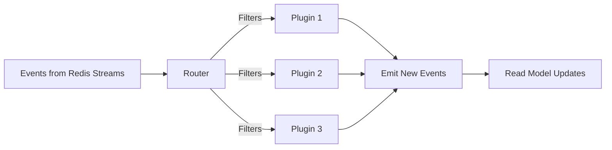
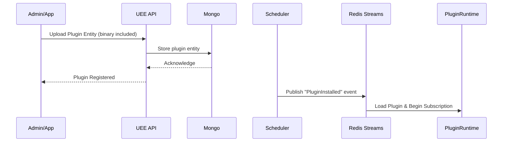
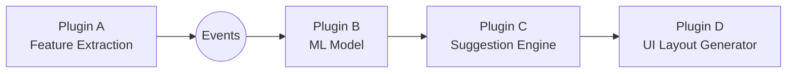

# Universal Entity Engine (UEE)

## Plugin Architecture (WASM & Native Extensions)

### Audience: AI Agents • Developers • Architects • Non‑Technical Readers

---

## 🚀 1. Introduction

Plugins are the **heart** of the Universal Entity Engine (UEE).  
They enable UEE to function not merely as a data backend, but as an **extensible operating system** capable of running:

- Custom workflows  
- Domain logic  
- Machine learning inference  
- AI-based suggestions  
- Event processors  
- Read model materializers  
- Validation rules  
- UI schema generators  
- Background jobs  
- Experiments / A/B tests  
- Scheduling and automations  

Plugins turn the UEE from a static service into a **dynamic learning organism**.

---

## 🧩 2. Plugin Types

UEE supports three major plugin classes:

### **1. Event Plugins**

Triggered by events published to Redis Streams.

Uses:

- Maintaining read models  
- Reacting to entity lifecycle changes  
- Scheduling background tasks  
- Triggering workflows  
- Event enrichment  

### **2. Workflow Plugins**

Define multi-step logic:

- Multi-step task automations  
- CRM funnels  
- AI decision trees  
- Prompt flows  
- Data cleaning pipelines  

### **3. ML & AI Plugins**

Provide:

- Predictions  
- Recommendations  
- Feature extraction  
- Embeddings  
- Summaries  
- Adaptive guidance  

These plugins can be WASM-based or remote model endpoints.

---

## 🧱 3. Fundamental Plugin Entity Schema

Plugins are themselves **entities** in the UEE:

```json
{
  "entityId": "GUID",
  "entityTypeId": "uee.plugin",
  "tenantId": null,
  "ownerId": null,
  "version": 3,
  "attributes": {
    "name": "DivFlo.TaskPrioritizer",
    "language": "wasm",
    "subscribeTo": ["TaskCreated", "TaskUpdated"],
    "permissions": {
      "canReadEntities": true,
      "canWriteEntities": true,
      "canEmitEvents": true
    },
    "settings": { "model": "ml/task/priority-v2" },
    "binary": "<WASM bytes or reference>"
  }
}
```

The plugin can:

- Define which event types it listens to  
- Declare permissions  
- Declare settings (configurable per tenant)  
- Embed a WASM binary or reference an external model  

---

## 🏗️ 4. Plugin Execution Pipeline



---

## ⚙️ 5. WASM Plugin Runtime

WASM (WebAssembly) plugins are:

- Sandboxed  
- Safe by default  
- Portable  
- Fast  
- Language‑agnostic  

WASM is ideal because it allows:

- AI agents to write plugins in any language  
- Safe user-generated code  
- Multi-tenant isolation  
- Fine-grained resource control  
- Deterministic execution  

### WASM plugins communicate via

- Event envelopes  
- JSON/BSON entity payloads  
- Host functions (provided by UEE)  
- A controlled capability model  

---

### 🔐 6. Plugin Capabilities & Permissions

Plugins declare capabilities explicitly:

| Capability | Description |
|-----------|-------------|
| **readEntities** | Read any allowed entity state |
| **writeEntities** | Create new versions of entities |
| **emitEvents** | Publish events to the event stream |
| **updateReadModels** | Modify projection DBs |
| **accessTenantConfig** | Read tenant-level settings |
| **invokeModels** | Use ML/AI model endpoints |
| **executeTimers** | Access scheduled jobs / delays |
| **spawnWorkflows** | Launch workflow plugins |

This prevents plugins from overreaching tenant boundaries.

---

### 🔐 6.1 Access Control Evaluator Plugins

Plugins can implement custom access control logic by providing an `IAccessControlEvaluator`.

### The Interface

```csharp
/// <summary>
/// Evaluates access control for entities based on custom logic.
/// Register as a plugin to extend the built-in access models.
/// </summary>
public interface IAccessControlEvaluator
{
    /// <summary>
    /// The unique name of this access model (e.g., "Hierarchical", "TimeBased").
    /// Referenced in EntityType.attributes.accessControl.model
    /// </summary>
    string ModelName { get; }

    /// <summary>
    /// Evaluates whether the current user can access the entity.
    /// </summary>
    Task<AccessResult> EvaluateAsync(
        IEntity entity,
        EntityType entityType,
        AccessContext context,
        CancellationToken cancellationToken = default);

    /// <summary>
    /// Evaluates access for a batch of entities (optimization).
    /// Default implementation calls EvaluateAsync for each.
    /// </summary>
    Task<IReadOnlyList<AccessResult>> EvaluateBatchAsync(
        IReadOnlyList<IEntity> entities,
        EntityType entityType,
        AccessContext context,
        CancellationToken cancellationToken = default);
}

/// <summary>
/// Context provided to access evaluators.
/// </summary>
public record AccessContext(
    Guid UserId,
    Guid? TenantId,
    IReadOnlySet<string> UserRoles,
    IReadOnlyDictionary<string, object> Claims,
    DateTimeOffset RequestTime);

/// <summary>
/// Result of an access evaluation.
/// </summary>
public record AccessResult(
    bool Granted,
    AccessLevel EffectiveLevel = AccessLevel.None,
    string? DenialReason = null,
    DateTimeOffset? ExpiresAt = null);

/// <summary>
/// Levels of access that can be granted.
/// </summary>
public enum AccessLevel
{
    None = 0,
    Read = 1,
    Write = 2,
    Delete = 3,
    Admin = 4
}
```

### Built-in Evaluators

UEE ships with these default evaluators:

| Model | Class | Description |
|-------|-------|-------------|
| `Ownership` | `OwnershipAccessEvaluator` | Grants access if `OwnerId == UserId` |
| `Shared` | `SharedAccessEvaluator` | Checks `OwnerId` and `metadata.sharedWith` |
| `TenantVisible` | `TenantVisibleAccessEvaluator` | Grants to all users in same tenant |
| `RoleBased` | `RoleBasedAccessEvaluator` | Checks user roles against required roles |
| `Public` | `PublicAccessEvaluator` | Grants to all authenticated users |

### Example: Hierarchical Access Evaluator Plugin

This plugin inherits access from parent entities (e.g., folder → document):

```csharp
public class HierarchicalAccessEvaluator : IAccessControlEvaluator
{
    public string ModelName => "Hierarchical";

    private readonly IEntityRepository _repository;
    private readonly IAccessControlService _accessService;

    public HierarchicalAccessEvaluator(
        IEntityRepository repository,
        IAccessControlService accessService)
    {
        _repository = repository;
        _accessService = accessService;
    }

    public async Task<AccessResult> EvaluateAsync(
        IEntity entity,
        EntityType entityType,
        AccessContext context,
        CancellationToken cancellationToken = default)
    {
        // Check direct ownership first
        if (entity.OwnerId == context.UserId)
        {
            return new AccessResult(true, AccessLevel.Admin);
        }

        // Check explicit shares on this entity
        var sharedWith = entity.Metadata.GetValueOrDefault("sharedWith") as IList<object>;
        if (sharedWith != null)
        {
            var share = sharedWith
                .Cast<IDictionary<string, object>>()
                .FirstOrDefault(s => s["userId"]?.ToString() == context.UserId.ToString());

            if (share != null)
            {
                var role = share["role"]?.ToString();
                var level = role switch
                {
                    "Admin" => AccessLevel.Admin,
                    "Editor" => AccessLevel.Write,
                    "Viewer" => AccessLevel.Read,
                    _ => AccessLevel.Read
                };
                return new AccessResult(true, level);
            }
        }

        // Check parent entity (hierarchical inheritance)
        var parentId = entity.Attributes.GetValueOrDefault("parentEntityId") as string;
        if (!string.IsNullOrEmpty(parentId) && Guid.TryParse(parentId, out var parentGuid))
        {
            var parent = await _repository.GetLatestAsync(parentGuid, cancellationToken);
            if (parent != null)
            {
                var parentType = await _repository.GetEntityTypeAsync(parent.EntityTypeId, cancellationToken);
                var parentResult = await _accessService.EvaluateAsync(parent, parentType, context, cancellationToken);
                
                if (parentResult.Granted)
                {
                    // Inherit from parent, but cap at Write (not Admin)
                    var cappedLevel = parentResult.EffectiveLevel > AccessLevel.Write 
                        ? AccessLevel.Write 
                        : parentResult.EffectiveLevel;
                    return new AccessResult(true, cappedLevel);
                }
            }
        }

        return new AccessResult(false, DenialReason: "No access to entity or its parents");
    }
}
```

### Example: Time-Based Access Evaluator Plugin

Grants temporary access that expires:

```csharp
public class TimeBasedAccessEvaluator : IAccessControlEvaluator
{
    public string ModelName => "TimeBased";

    public Task<AccessResult> EvaluateAsync(
        IEntity entity,
        EntityType entityType,
        AccessContext context,
        CancellationToken cancellationToken = default)
    {
        var sharedWith = entity.Metadata.GetValueOrDefault("sharedWith") as IList<object>;
        if (sharedWith == null)
        {
            // Fall back to ownership check
            if (entity.OwnerId == context.UserId)
                return Task.FromResult(new AccessResult(true, AccessLevel.Admin));
            
            return Task.FromResult(new AccessResult(false, DenialReason: "Not shared"));
        }

        var share = sharedWith
            .Cast<IDictionary<string, object>>()
            .FirstOrDefault(s => s["userId"]?.ToString() == context.UserId.ToString());

        if (share == null)
        {
            return Task.FromResult(new AccessResult(false, DenialReason: "Not in share list"));
        }

        // Check time-based expiration
        if (share.TryGetValue("expiresAt", out var expiresAtObj) && 
            DateTimeOffset.TryParse(expiresAtObj?.ToString(), out var expiresAt))
        {
            if (context.RequestTime > expiresAt)
            {
                return Task.FromResult(new AccessResult(
                    false, 
                    DenialReason: $"Access expired at {expiresAt:u}"));
            }

            var role = share["role"]?.ToString() ?? "Viewer";
            var level = role switch
            {
                "Admin" => AccessLevel.Admin,
                "Editor" => AccessLevel.Write,
                _ => AccessLevel.Read
            };

            return Task.FromResult(new AccessResult(true, level, ExpiresAt: expiresAt));
        }

        // No expiration, permanent share
        return Task.FromResult(new AccessResult(true, AccessLevel.Read));
    }
}
```

### Registering Custom Evaluators

Custom evaluators are registered as plugin entities:

```json
{
  "entityId": "plugin-hierarchical-access",
  "entityTypeId": "uee.plugin",
  "tenantId": null,
  "attributes": {
    "name": "HierarchicalAccessEvaluator",
    "type": "AccessControlEvaluator",
    "modelName": "Hierarchical",
    "language": "dotnet",
    "assembly": "DivFlo.Plugins.Access",
    "className": "DivFlo.Plugins.Access.HierarchicalAccessEvaluator"
  }
}
```

Then reference in EntityType:

```json
{
  "entityId": "type-document",
  "entityTypeId": "uee:entityType",
  "attributes": {
    "name": "DivFlo.Document",
    "accessControl": {
      "model": "Hierarchical",
      "allowSharing": true,
      "defaultAccess": "Private"
    }
  }
}
```

---

## 🧪 7. Plugin Sandboxing

Sandboxing ensures:

- No filesystem access (unless explicitly granted)  
- No network access beyond ML/model APIs  
- Controlled CPU/memory limits  
- Execution timeouts  
- Tenant-aware identity  

UEE guarantees:

- Tenant isolation  
- Per-plugin isolation  
- Per-event execution budgeting  

---

## 🕸 8. Plugin Discovery & Registration

Plugins are installed by creating a `uee.plugin` entity.

### Plugin registration flow



Plugins can be:

- Global (tenantId = null)  
- Tenant-specific  
- User-specific  

---

## 🧬 9. Plugin Deployment Models

### **1. Embedded WASM binary**

Stored directly in the plugin’s entity.

### **2. External Model Endpoint**

The plugin includes a URL to:

- A model endpoint  
- A prompt server  
- A vector embedding service  
- A remote workflow engine  

### **3. Hybrid**

WASM executes local preprocessing  
→ remote model performs inference  
→ WASM interprets results  

---

## 🛠️ 10. Plugin Host API (Capabilities Exposed to WASM)

UEE exposes a minimal, safe host API.

### Host Functions

```rust
fn read_entity(entity_id: Guid) -> Entity;
fn write_entity(entity: EntityVersionCreate);
fn emit_event(event: EventEnvelope);
fn query_read_model(view: String, filters: ...);
fn get_tenant_config() -> Config;
fn log(message: String);
fn call_model(model_name: String, input: Json) -> Json;
```

Each host function enforces:

- Tenant restrictions  
- Read/write permissions  
- Rate limits  
- Execution budgeting  

---

## 🧠 11. Example Plugin: ML-based Task Prioritizer (DivFlo)

This plugin:

- Listens to all task updates  
- Computes energy-weighted priority  
- Writes enriched metadata to read model  
- Emits suggestions for next actions  

### Pseudocode

```rust
on_event(TaskUpdated evt):
    features = extract_features(evt.entity)
    score = call_model("task.prioritizer.v2", features)
    updated = evt.entity.clone()
    updated.metadata["priorityScore"] = score
    write_entity(updated)
```

---

## 🔥 12. Example Plugin: Workflow Engine

A workflow plugin can:

- Trigger multiple sub-events  
- Maintain state machines  
- Spawn follow-up workflows  
- Validate user input  

Example state machine:

```json
{
  "states": ["Draft", "InProgress", "Done"],
  "transitions": {
    "Draft": ["InProgress"],
    "InProgress": ["Done"]
  }
}
```

Plugins can materialize workflow views and enforce transitions.

---

## 📡 13. Plugins in Multi-Tenant Scenarios

Plugins may declare:

- `tenantScope: global | tenant | user`  
- `restrictedEntityTypes`  
- `maximumResourceBudget`  

UEE ensures:

- Plugins see only entities reachable by the tenant  
- Cross-tenant leaks are impossible  
- Workflows never cross boundaries unless explicitly configured  

---

## 🧩 14. Plugin Composition (Chaining)

Plugins can chain by emitting events other plugins subscribe to.



Plugins form **event-driven pipelines** that behave like microservices inside the UEE universe.

---

## 🎛 15. Hot Reloading & Versioning

Plugins are versioned entities, so:

- New plugin version is deployed as a new entity  
- Old version continues running until disabled  
- Tenants may pin to specific versions  
- Experiments can A/B test multiple plugin versions  
- Reverting is trivial (use older plugin version)  

---

## 🧠 16. AI Agent Integration

AI Agents can:

- Generate plugin code (Rust, Go, AssemblyScript, Python→WASM)  
- Deploy plugins  
- Update plugin configuration  
- Run experiments  
- Optimize read models  
- Evolve workflows automatically  

UEE is designed for **AI-native operations**.  
Plugins are the primary API that AI agents use to evolve the system.

---

## 🏁 17. Summary

The Plugin System of the UEE provides:

- Infinite extensibility  
- Safe sandboxed execution  
- WASM-based cross-language development  
- Dynamic ML/AI intelligence  
- Custom workflows & projections  
- Multi-tenant isolation  
- Versioned, repeatable, auditable behavior  
- Event-driven automation  
- AI-driven evolution  

Plugins transform UEE from a data engine into an **operating system for adaptive, intelligent, multi-tenant applications**.

---
