```mermaid
flowchart LR
    C[Client Apps<br/>Web, Mobile, CLI, AI Agents] --> API[UEE API Gateway]

    API --> CMD[Command Endpoint]
    API --> QRY[Query Endpoint]
    API --> SRCH[Search Endpoint]
    API --> PLG[Plugin Management]
    API --> VIEW[Read Model Discovery]

    CMD --> ES[Event Store &#40;Mongo&#41;]
    QRY --> RM[Read Models]
    SRCH --> IDX[Indexing Layer]
    PLG --> PRUNTIME[Plugin Runtime]
```

# Filename: 07-API.md
# Universal Entity Engine (UEE)
## API Specification (Commands, Queries, Patterns)
### Audience: AI Agents • Developers • Architects • Non‑Technical Readers

---

# 🌐 1. Introduction

The **UEE API** provides a unified, language‑agnostic interface for all applications, plugins, and AI agents interacting with the Universal Entity Engine.

The API supports:
- **Commands** (write operations)
- **Queries** (read operations)
- **Search**
- **Plugin registration & invocation**
- **Read-model discovery**
- **EntityType introspection**
- **AI/ML model invocation (via plugins)**

It is designed to be:
- Simple enough for non‑technical users  
- Expressive enough for full-stack developers  
- Machine-friendly for AI integration  

---

# 🧭 2. API Architecture Overview



---

# 🧱 3. Base API Concepts

UEE follows **REST‑style** patterns with JSON documents.

## Endpoint families:
- `/entities` → CRUD commands, history, bulk operations  
- `/views` → read model queries  
- `/events` → debugging, audit queries  
- `/plugins` → plugin installation and management  
- `/types` → entity type introspection  
- `/search` → full‑text and filtered search  

## Response common fields:
```json
{
  "success": true,
  "timestamp": "2026-02-02T20:33:14Z",
  "data": { ... },
  "traceId": "abc123",
  "warnings": []
}
```

---

# ✉️ 4. Command API (Write Model)

Commands always:
- Are **validated**
- Create **events**
- Increment **version**
- Are **eventually consistent**

### Command pattern:
```
POST /entities/{entityId}/commands/{commandName}
```

Examples:
```
POST /entities/123/commands/update
POST /entities/123/commands/delete
POST /entities/123/commands/patch
POST /entities/new/commands/create
```

### Create example:
```json
POST /entities/new/commands/create

{
  "entityTypeId": "DivFlo.Task",
  "tenantId": "tenant-42",
  "ownerId": "user-11",
  "attributes": {
    "title": "Plan weekly goals",
    "priority": 2
  }
}
```

### Response:
```json
{
  "success": true,
  "entityId": "6d23-8844-2200",
  "version": 1
}
```

---

# 🔁 5. Update Command

### Update (replace attributes):
```
POST /entities/{entityId}/commands/update
```

```json
{
  "expectedVersion": 5,
  "attributes": {
    "title": "Plan weekly goals (updated)",
    "priority": 1
  }
}
```

---

# 🩹 6. Patch Command

Allows partial updates.

```
POST /entities/{id}/commands/patch
```

```json
{
  "expectedVersion": 7,
  "patch": {
    "priority": 0,
    "energyRequired": 0.9
  }
}
```

---

# 🪦 7. Delete / Restore

Soft delete only.

```
POST /entities/{id}/commands/delete
POST /entities/{id}/commands/restore
```

---

# 🧬 8. Custom Commands (Plugin-defined)

Plugins can define domain commands.

Example:
```
POST /entities/{id}/commands/startWorkflow
POST /entities/{id}/commands/transition
POST /entities/{id}/commands/applyModel
```

UEE discovers them from plugin metadata.

---

# 🔍 9. Query API (Read Models)

Queries always return **materialized state**, not events.

## Pattern 1: Basic Entity View
```
GET /entities/{entityId}
```

Response:
```json
{
  "entityId": "1100-2200",
  "version": 9,
  "entityTypeId": "DivFlo.Task",
  "attributes": { ... }
}
```

## Pattern 2: Version History
```
GET /entities/{entityId}/versions
```

Returns:
```json
{
  "versions": [1,2,3,4,5,6,7,8,9]
}
```

## Pattern 3: Specific Version
```
GET /entities/{entityId}/versions/{version}
```

---

# 📊 10. Read Model Queries

Read models represent **views**.

General form:
```
GET /views/{viewName}
```

### Example:
```
GET /views/DivFlo.TaskBoard?tenantId=42&ownerId=user-11
```

Response:
```json
{
  "items": [
    { "entityId": "a1", "title": "Task 1", "priority": 1 },
    { "entityId": "a2", "title": "Task 2", "priority": 3 }
  ]
}
```

---

# 🔎 11. Search API

Full‑text and filtered search combining:
- Attributes  
- Metadata  
- Tags  
- EntityType  
- TenantId  

### Example:
```
GET /search?q=priority:high AND title:goals&entityType=DivFlo.Task
```

---

# 🧠 12. Plugin Management API

Plugins are managed like any other entity.

## Register plugin:
```
POST /plugins
```

Payload:
```json
{
  "name": "DivFlo.TaskPrioritizer",
  "language": "wasm",
  "binary": "<WASM bytes>"
}
```

## Enable plugin:
```
POST /plugins/{pluginId}/enable
```

## Disable plugin:
```
POST /plugins/{pluginId}/disable
```

## Query plugin metadata:
```
GET /plugins/{pluginId}
```

---

# 🧩 13. Entity Type API

UEE allows dynamic schema definition.

## List types:
```
GET /types
```

## Get type:
```
GET /types/{entityTypeId}
```

## Create type:
```
POST /types
```

---

# 🧠 14. AI / ML Model Invocation (Via Plugins)

Plugins can expose ML inference endpoints via the API.

### Example:
```
POST /ml/models/task.prioritizer/infer
```

Payload:
```json
{
  "entityId": "task-115",
  "input": { "...": "..." }
}
```

Returned by plugin logic.

---

# 🛡 15. Authentication & Authorization

UEE supports:
- OAuth2  
- JWT  
- API keys  
- Tenant-scoped keys  
- User tokens  
- Plugin service accounts  

### Security responsibilities:
- API checks tenant membership  
- Plugin permissions enforced at execution time  
- Read model queries filtered by metadata  
- Commands validate ownership  

---

# 📦 16. Pagination, Sorting, Filtering

Applies to:
- `/views`
- `/search`
- `/entities` (list queries)

Standard patterns:
```
?page=1&size=20&sort=priority:desc&filter=ownerId:user-11
```

---

# 🤝 17. API for Multi-Application Ecosystems

Applications built on UEE should:
- Define their own EntityTypes via API  
- Create their own plugins  
- Define their own read models  
- Interoperate with tenant/user boundaries  

The API is the cross-application collaboration layer.

---

# 📘 18. Example: DivFlo Client Usage

### Create a task:
```
POST /entities/new/commands/create
```

### Update a task:
```
POST /entities/{id}/commands/update
```

### Read board:
```
GET /views/DivFlo.TaskBoard
```

### Run ML prioritizer:
```
POST /plugins/task-prioritizer/infer
```

---

# 🧠 19. API Usage for AI Agents

AI agents use the API to:
- Explore entity types  
- Generate new entities  
- Update workflows  
- Create plugins  
- Rebuild read models  
- Interact with telemetry  

Patterns are stable, predictable, and LLM-friendly.

---

# 🏁 20. Summary

The UEE API provides:
- Clean separation between commands and queries  
- Uniform entity envelopes  
- Dynamic, plugin-driven extensibility  
- AI-friendly endpoints  
- Safe multi-tenant behavior  
- Fast access via L1/L2 caching  
- Structured, LLM-readable patterns  

The API is not just a transport layer —  
it is the **interface to the Universal Entity Operating System**.

---