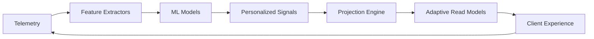

# Filename: 08-Telemetry.md
# Universal Entity Engine (UEE)
## Telemetry, Observability, and ML Signal Architecture  
### Audience: AI Agents • Developers • Architects • Non‑Technical Readers

---

# 📡 1. Introduction

Telemetry is a **first‑class subsystem** of the Universal Entity Engine (UEE).

Every action, every entity change, every plugin execution, every workflow transition, and every user interaction produces **meaningful, structured signals**.

UEE treats telemetry not as a logging add‑on but as a **core behavioral data graph** that empowers:

- AI-driven personalization  
- Cross-application insights  
- Workflow optimization  
- Predictive modeling  
- Energy-pattern detection  
- Habit analysis  
- Adaptive UI design  
- Error recovery & resilience  
- Experimental workflows and A/B testing  
- Mental‑model-aware interfaces for neurodiverse users  

Telemetry is the nervous system of UEE.

---

# 🧠 2. Philosophy of Telemetry in UEE

UEE embraces a unique philosophy:

> **Everything is an observation. Everything is useful. Nothing is lost.**

Because UEE is event-sourced, the **entire event history _is_ telemetry**.

This means:
- No special "tracking events" required  
- No extra logging layers  
- No dual data pipelines  
- No risk of losing critical behavioral details  

Telemetry = events  
Events = truth  
Truth = learning  

---

# 🔎 3. Categories of Telemetry

UEE emits four major classes of telemetry.

---

## **1. Structural Telemetry**  
Captures state changes in entities:

- EntityCreated  
- EntityUpdated  
- EntityDeleted  
- RelationshipAdded  
- RelationshipRemoved  
- Type evolved  
- Plugin installed  

This forms the **structural backbone** of the UEE universe.

---

## **2. Behavioral Telemetry**  
Captured at the moment of user interaction:

- “ViewedTask”
- “ExpandedProject”
- “EditedField”
- “TriggeredWorkflow”
- “NavigatedToScreen”
- “OpenedApp”
- “StalledOnTask”
- “CompletedTask”
- “DeferredTask”
- “OverdueTask”

These are essential for:
- Adaptive UX  
- Personal energy profiling  
- Understanding motivation & friction  
- Flow-state analysis  
- Preventing overwhelm  

---

## **3. System Telemetry**  
Generated internally:

- Plugin runtime metrics  
- Projection duration  
- Redis consumer lag  
- DB latency  
- Command throughput  
- Read model rebuild timings  
- WASM memory & compute usage  

Used for:
- Capacity planning  
- Autoscaling  
- Failure prediction  
- SLA monitoring  

---

## **4. AI/ML Telemetry**  
Generated during ML processes:

- Feature extraction events  
- Model inference calls  
- Model confidence levels  
- Drift detection  
- Embedding updates  
- Personalization decisions  
- Reinforcement signals  

Critical for:
- Training behavior models  
- Adapting to user patterns  
- Experimentation & tuning  

---

# 🧱 4. Telemetry Event Envelope

All telemetry events share a standard envelope:

```json
{
  "telemetryId": "GUID",
  "type": "Behavioral.TaskViewed",
  "entityId": "GUID | null",
  "tenantId": "GUID | null",
  "ownerId": "GUID | null",
  "timestamp": "ISO-UTC",
  "metadata": {
    "source": "DivFlo.UI",
    "device": "web",
    "context": "TaskBoard",
    "durationMs": 382,
    "tags": ["ux", "interaction"]
  }
}
```

UEE does **not** separate telemetry vs events internally — this envelope is simply a subtype of the event model.

---

# 🧬 5. Telemetry Flow Through UEE

```mermaid
flowchart TB
    A[User / System Interaction] --> B[Command or Read]
    B --> C[Event Emitted &#40;Telemetry&#41;]
    C --> D[Mongo Event Store]
    D --> E[Redis Streams &#40;Telemetry Group&#41;]
    E --> F[Telemetry Processors]
    F --> G[Feature Extractors]
    G --> H[ML Models]
    H --> I[Personalization Engine]
    I --> J[Adaptive Read Models]
    J --> K[UI / Client Apps]
```



Telemetry → ML → Personalized read models → Adaptive UI.

---

# ⚙️ 6. Telemetry Storage Model

Telemetry lives in two places:

### **1. Mongo Events (Canonical Source)**
Everything is stored as events.

Advantages:
- Perfect replay  
- Deterministic analysis  
- Zero loss  
- Temporal ordering  
- ML-friendly chronological layout  

### **2. Telemetry Read Models (Derived)**
Optimized indexes for:
- Querying  
- Aggregating  
- ML feature pipelines  

Examples:
- `read_model.telemetry.behavioral`
- `read_model.telemetry.ml_features`
- `read_model.telemetry.aggregates`
- `read_model.telemetry.user_profiles`

---

# 🧠 7. Feature Extraction (ML Pipeline Stage 1)

Feature extractors are **plugins** subscribed to telemetry streams.

Features include:
- Task interaction frequency  
- Energy usage patterns  
- Completion/abandonment cycles  
- Circadian rhythm markers  
- Context switching rates  
- Overwhelm threshold signals  
- Time-to-engage per task type  
- Recurrence patterns  

Example extracted feature document:
```json
{
  "userId": "user-11",
  "features": {
    "avgCompletionTime": 322.5,
    "morningEnergyScore": 0.77,
    "overwhelmProbability": 0.13,
    "taskSwitchRate": 4.8
  }
}
```

---

# 🧠 8. ML Model Integration (Telemetry → Intelligence)

ML plugins consume feature views and produce insights:

- Next-action recommendations  
- Task prioritization  
- Energy-level forecasting  
- Habit-building suggestions  
- Flow-state predictions  
- Cognitive load estimates  
- Optimal notification timing  
- Task clustering & embedding  

Each insight creates:
- New entities  
- New read models  
- Updated personalization profiles  

---

# 🎯 9. Personalization Pipeline

UEE supports a *closed-loop* personalization cycle.



The UI experience adapts over time, and the adaptation is measured and fed back into the system.

---

# 🧘 10. Neurodiversity-Aware Telemetry

UEE’s telemetry is explicitly designed to support **divergent thinkers**, such as users with ADHD.

Signals intentionally tracked:
- Overwhelm patterns  
- Abandonment cycles  
- Reward-trigger timing  
- Task initiation latency  
- Energy spikes/dips  
- Hyperfocus windows  
- Context switching frequency  

These signals allow AI agents to build:
- Shame-free workflows  
- Gentle re-engagement systems  
- Nonlinear task paths  
- Personalized pacing  
- Fresh-start-friendly UX resets  

This is a **core mission** of the UEE.

---

# 🧪 11. Telemetry for Experiments & A/B Testing

UEE allows experiments to be defined as entities:

```json
{
  "entityTypeId": "uee.experiment",
  "attributes": {
    "name": "TaskBadgeColorExperiment",
    "variants": ["blue", "purple", "yellow"],
    "targetUsers": "all",
    "durationDays": 28
  }
}
```

Telemetry automatically:
- Tracks variant assignment  
- Measures impact on engagement  
- Records preference drift  
- Reports winners  
- Adapts personalized models  

---

# 🧯 12. Telemetry for Error Recovery & Resilience

Telemetry includes system-level events:
- Projection failures  
- Plugin timeouts  
- ML model drift  
- Redis lag  
- Database retries  
- Cache invalidations  

Used to:
- Auto-heal projections  
- Reroute plugin workloads  
- Detect partial-outages  
- Trigger rebuilds  
- Alert AI agents and developers  

---

# 📊 13. Telemetry Dashboards (Generated as Read Models)

Dashboards themselves are **entities**:

```json
{
  "entityTypeId": "uee.dashboard",
  "attributes": {
    "name": "Tenant Productivity Overview",
    "views": [
      "telemetry.aggregation.daily",
      "telemetry.user.energyProfile",
      "telemetry.behavioral.taskSwitchHeatmap"
    ]
  }
}
```

Client apps can render these dashboards automatically.

---

# 🏁 14. Summary

UEE telemetry provides:
- Complete event-level truth  
- Behavioral intelligence  
- ML-ready timelines  
- Cross-application personalization  
- Neurodiversity-aware UX adaptation  
- Plugin-driven extensibility  
- Deterministic replay  
- System observability  
- Safe multi-tenant segmentation  

Telemetry is not an optional subsystem —  
it is **the lifeblood of the Universal Entity Engine.**

---