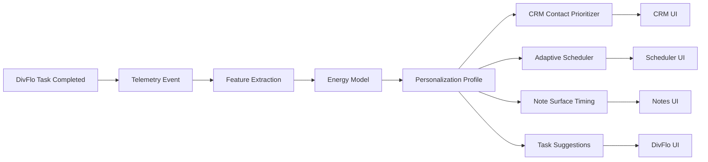

# Filename: 09-DomainExamples.md
# Universal Entity Engine (UEE)
## Domain Examples & Application Patterns  
### Audience: AI Agents • Developers • Architects • Non‑Technical Readers

---

# 🎯 1. Introduction

This document demonstrates **practical, domain‑level examples** of how real applications can be built on top of the **Universal Entity Engine (UEE)**.

These examples illustrate:
- How entities, events, read models, plugins, and telemetry work together  
- How multi‑tenant + multi‑user rules map to application logic  
- How ML signals and adaptive workflows enhance UX  
- How AI agents participate in system evolution  
- How multiple applications share a single UEE substrate  

Domains covered:
1. **DivFlo (Divergent Flow)** — Task + Personal Workflow Engine  
2. **CRM Lite** — Lightweight, adaptive customer tracking  
3. **Energy Tracker** — Behavioral telemetry + energy profiling  
4. **Universal Notes** — Schema‑free knowledge capture  
5. **Adaptive Scheduler** — AI‑guided task/time balancing  
6. **Cross‑App Personalization** — Combining app intelligence  

---

# 🧠 2. Example Domain: DivFlo (Divergent Flow Task Manager)

DivFlo is the **flagship example** for UEE:  
A neurodiversity‑friendly task system designed to adapt to each user.

---

## **2.1 Core EntityTypes**

```json
{
  "entityTypeId": "DivFlo.Task",
  "attributes": {
    "schema": {
      "title": "string",
      "description": "string?",
      "priority": "int",
      "energyRequired": "float?",
      "dueDate": "datetime?",
      "completed": "bool"
    }
  }
}
```

Additional types:
- `DivFlo.Project`
- `DivFlo.RecurringRule`
- `DivFlo.Context`
- `DivFlo.FocusSession`

All are stored as **entities**, versioned, event‑sourced.

---

## **2.2 Example Task Entity (Version 1)**

```json
{
  "entityId": "task-001",
  "version": 1,
  "entityTypeId": "DivFlo.Task",
  "tenantId": "tenant-A",
  "ownerId": "user-123",
  "attributes": {
    "title": "Write weekly summary",
    "priority": 2,
    "completed": false
  }
}
```

---

## **2.3 Example Workflow Plugin: “Overwhelm‑Blocker”**

```rust
on_event(TaskUpdated evt):
    if evt.data.priority == 1 and user.energy < 0.3:
        emit_event("TaskDeferred", { ... })
        log("User energy low - deferring high-priority task.")
```

This supports ADHD‑friendly pacing.

---

## **2.4 DivFlo Read Model: TaskBoard**

```
GET /views/DivFlo.TaskBoard
```

Materialized view includes:
```json
{
  "title": "Write weekly summary",
  "priority": 2,
  "energyScore": 0.61,
  "dueSoon": false,
  "streak": 4,
  "isOverdue": false
}
```

Projections enrich the view with:
- ML scores  
- Streaks  
- Behavioral signals  

---

# 📇 3. Example Domain: CRM Lite

A simple CRM built entirely from UEE entities.

---

## **3.1 EntityTypes**

- `CRM.Contact`
- `CRM.Opportunity`
- `CRM.Interaction`

Example Contact:
```json
{
  "entityTypeId": "CRM.Contact",
  "attributes": {
    "name": "string",
    "email": "string",
    "phone": "string?",
    "notes": "string?"
  }
}
```

---

## **3.2 ML Plugin: Relationship Strength Score**

Input signals:
- Frequency of interactions  
- Response times  
- Sentiment score (from text analysis)  
- Time since last contact  

Output:
```json
{
  "relationshipScore": 0.83
}
```

---

## **3.3 CRM Dashboard (Read Model Entity)**

```json
{
  "entityTypeId": "CRM.ContactDashboard",
  "attributes": {
    "contactId": "GUID",
    "relationshipScore": 0.83,
    "lastInteraction": "2026-02-01",
    "openOpportunities": 3
  }
}
```

---

# ⚡ 4. Example Domain: Energy Tracker

Tracks behavioral signals to infer user energy patterns.

---

## **4.1 Telemetry Events**

```json
"Telemetry.TaskCompleted"
"Telemetry.TaskDeferred"
"Telemetry.FocusSessionStarted"
"Telemetry.Interaction.Latency"
```

Each contributes signals to:
- MorningEnergy  
- AfternoonDip  
- DeepFocusWindow  
- InterruptibilityIndex  

---

## **4.2 ML Plugin: Energy Predictor**

```rust
on_event(FeatureExtracted f):
    energy = call_model("energy.predictor", f)
    write_entity({
        "entityTypeId": "UEE.EnergyProfile",
        "attributes": { "timestamp": now, "energy": energy }
    })
```

Produces rolling energy patterns that DivFlo and other apps can consume.

---

# 📝 5. Example Domain: Universal Notes

A flexible note-taking model using schemaless entities.

---

## **5.1 Note EntityType**

```json
{
  "entityTypeId": "UEE.Note",
  "attributes": {
    "schema": {
      "title": "string",
      "content": "string",
      "tags": "list<string>",
      "links": "list<entityId>"
    }
  }
}
```

---

## **5.2 Knowledge Graph Plugin**

Automatically creates edges between notes with semantic similarity.

```rust
on_event(NoteUpdated evt):
    embedding = call_model("text.embed", evt.attributes.content)
    related = vector_search("notes", embedding)
    for note in related:
        emit_event("RelationshipAdded", ...)
```

Creates a **semantic notes graph**.

---

# 📆 6. Example Domain: Adaptive Scheduler

An AI-powered scheduling assistant.

---

## **6.1 Entities**

- `Scheduler.TaskSlot`
- `Scheduler.Availability`
- `Scheduler.Constraint`
- `Scheduler.Recommendation`

Example constraint:
```json
{
  "entityTypeId": "Scheduler.Constraint",
  "attributes": {
    "type": "no-morning-meetings",
    "value": true
  }
}
```

---

## **6.2 Scheduling Plugin**

```rust
on_event(EnergyProfileUpdated evt):
    tasks = load_user_tasks()
    slots = load_availability()
    recommendation = call_model("schedule.optimizer", tasks, slots)
    write_entity(recommendation)
```

Produces:
```json
{
  "recommendedSchedule": [
    { "taskId": "t1", "time": "09:30" },
    { "taskId": "t2", "time": "14:00" }
  ]
}
```

---

# 🔗 7. Cross‑Application Personalization (The Superpower)

UEE allows *all apps* under a tenant to benefit from each other’s telemetry.

### For example:

- A **task manager** learns your energy rhythms  
- A **CRM** module uses that rhythm to schedule outreach  
- A **notes app** adjusts prompting frequency  
- A **calendar assistant** shifts meeting times  
- A **workflow engine** customizes nudge timing  

All through shared:
- Entities  
- Telemetry  
- ML profiles  
- Feature pipelines  
- Plugin outputs  
- Read models  

This creates an **adaptive OS-like experience**.

---

# 🌍 8. Multi-App Example Flow



---

# 🏁 9. Summary

This document demonstrated practical examples of applying UEE to:

- **Task Management (DivFlo)**  
- **CRM**  
- **Behavioral & Energy Tracking**  
- **Knowledge Systems**  
- **Scheduling**  
- **Cross-application intelligence**  

Each domain:
- Uses **entities** as the foundation  
- Leverages **event sourcing**  
- Builds **read models through projections**  
- Extends capabilities through **plugins**  
- Evolves intelligence through **ML**  
- Shares personalization across apps via **telemetry**  

UEE is not tied to any specific app domain —  
it is the **universal substrate** for adaptive, multi-tenant, AI-driven systems.

---