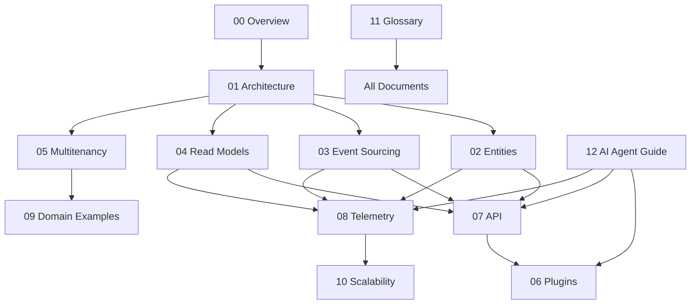

# Universal Entity Engine (UEE)

## Documentation Index & Navigation  

### Audience: AI Agents • Developers • Architects • Non‑Technical Readers

---

## 📚 1. Introduction

This file serves as the **master index** for the Universal Entity Engine (UEE) Documentation Suite.

It provides:

- A consolidated table of contents  
- Descriptions of each document  
- Suggested reading order  
- Navigation pointers for AI agents and developers  
- A mental map of how all concepts interconnect  

This index is intended to be used by:

- **Human developers**, as documentation navigation  
- **AI agents**, as a memory anchor and discovery point  
- **Non‑technical stakeholders**, as a high-level guide to the system  

---

## 📘 2. Documentation Suite Index

Below is a list of all documentation files in the UEE suite, with brief descriptions.

---

### **00‑Overview.md — Universal Introduction**

A conceptual overview of the UEE:

- What it is  
- Why it exists  
- Core philosophy  
- High-level architecture  

Ideal starting point for all readers.

---

### **01‑Architecture.md — System Architecture**

Describes:

- API layer  
- Event store  
- Redis Streams  
- Projections  
- Caching  
- Plugins  
- Telemetry flow  

This defines the structural backbone of UEE.

---

### **02‑Entities.md — Entity Model Specification**

Explains everything about:

- Entities  
- EntityTypes  
- Versioning  
- Attributes vs. Metadata  
- Ownership & visibility  
- Relationships  

The core data model of UEE.

---

### **03‑EventSourcing.md — Event Store & Write Model**

Covers:

- Event envelope  
- Mongo event store  
- Outbox  
- Version pointers  
- Event lifecycle  
- Concurrency  

This document is essential for understanding data correctness.

---

### **04‑ReadModels.md — Projections & Query Model**

Describes:

- Materialized views  
- Projection workers  
- Read model storage  
- L1/L2 cache  
- Dynamic view definitions  

Read models are how UEE expresses “current state”.

---

### **05‑Multitenancy.md — Tenant & User Isolation**

Explains:

- tenantId  
- ownerId  
- visibility rules  
- multi‑application tenancy  
- global defaults  
- tenant-specific plugins & views  

Critical for SaaS‑scale deployments.

---

### **06‑Plugins.md — WASM & Native Extensions**

Details:

- Plugin architecture  
- Permissions  
- Capabilities  
- WASM sandboxing  
- Workflow plugins  
- ML plugins  
- Plugin entity schema  

Defines how intelligence is added to UEE.

---

### **07‑API.md — Commands, Queries, and Endpoints**

Describes the full UEE API surface:

- Commands  
- Queries  
- Views  
- Search  
- Plugin management  
- ML endpoints  

Designed for both humans and AI agents.

---

### **08‑Telemetry.md — Behavioral and System Observability**

Covers:

- Telemetry envelopes  
- Behavioral signals  
- Feature extraction  
- ML pipelines  
- Adaptive UI/UX  
- Closed-loop personalization  

Telemetry is the lifeblood of UEE.

---

### **09‑DomainExamples.md — Practical Application Examples**

Includes worked examples for:

- DivFlo  
- CRM Lite  
- Energy Tracker  
- Adaptive Scheduler  
- Universal Notes  
- Cross‑application personalization  

Shows how to build apps on UEE.

---

### **10‑Scalability.md — From Startup to Planet-Scale**

Explains:

- API horizontal scaling  
- Event stream sharding  
- Projection pools  
- ML pipeline scaling  
- Geographic distribution  
- Multi‑region replication  

Defines UEE’s scale-out strategy.

---

### **11‑Glossary.md — Terminology Reference**

A comprehensive glossary for:

- Entities  
- Events  
- Plugins  
- Telemetry  
- Tenancy  
- ML concepts  
- Caching  

Useful for humans and AI agents.

---

### **12‑AI-Agent-Guide.md — Operating Instructions for AI Agents**

Explains:

- How AI agents should interact with UEE  
- Best practices for plugin generation  
- Schema creation  
- ML usage  
- Telemetry reasoning  
- Safe mutation patterns  
- AI “golden rules”  

Makes UEE an AI‑native platform.

---

### **13‑Overview-Index.md — (This File)**

You are here.

A navigation hub for the entire documentation set.

---

## 🧭 3. Recommended Reading Order

### For **Non‑Technical Readers**

1. 00‑Overview  
2. 05‑Multitenancy  
3. 09‑DomainExamples  
4. 08‑Telemetry  
5. 10‑Scalability  
6. 11‑Glossary  

### For **Developers**

1. 00‑Overview  
2. 01‑Architecture  
3. 02‑Entities  
4. 03‑EventSourcing  
5. 04‑ReadModels  
6. 07‑API  
7. 06‑Plugins  
8. 10‑Scalability  

### For **AI Agents**

1. 00‑Overview  
2. 12‑AI-Agent-Guide  
3. 07‑API  
4. 08‑Telemetry  
5. 04‑ReadModels  
6. 06‑Plugins  
7. 02‑Entities  

---

## 🧠 4. Mental Map of the UEE Documentation Suite

---

## 🔍 5. Document Interdependencies

### Architecture (01) is the root

All other documents depend on it.

### Entities (02), Event Sourcing (03), and Read Models (04)

form the **core data pipeline**.

### API (07) and Plugins (06)

form the **interaction and execution environment**.

### Telemetry (08) and AI Agent Guide (12)

form the **intelligence layer**.

### Multitenancy (05) and Scalability (10)

define the **SaaS capabilities**.

### Domain Examples (09)

show **practical application**.

### Glossary (11)

supports **all audiences**.

---

## 🏁 6. Summary

This index ties together the entire UEE documentation suite.

The UEE is composed of:

- **Entities** (universal knowledge objects)  
- **Events** (immutable truth)  
- **Read Models** (perception)  
- **Plugins** (intelligence)  
- **Telemetry** (learning)  
- **APIs** (interaction)  
- **Tenants/Users** (governance)  
- **AI Agents** (evolution)  
- **Scalability** (future-proofing)

This document gives you the **roadmap** to navigate the Universal Entity Engine, whether you’re a human developer, product owner, or autonomous AI agent.

---
